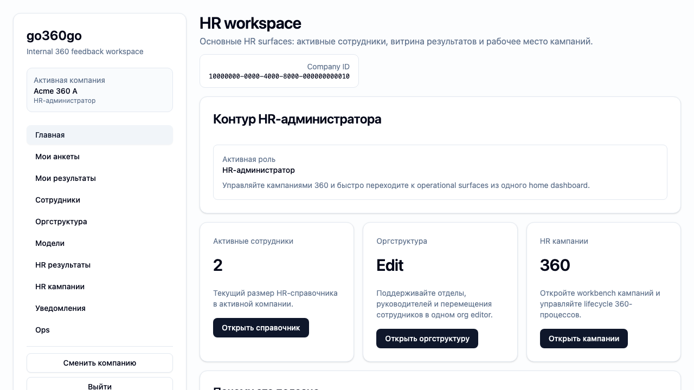
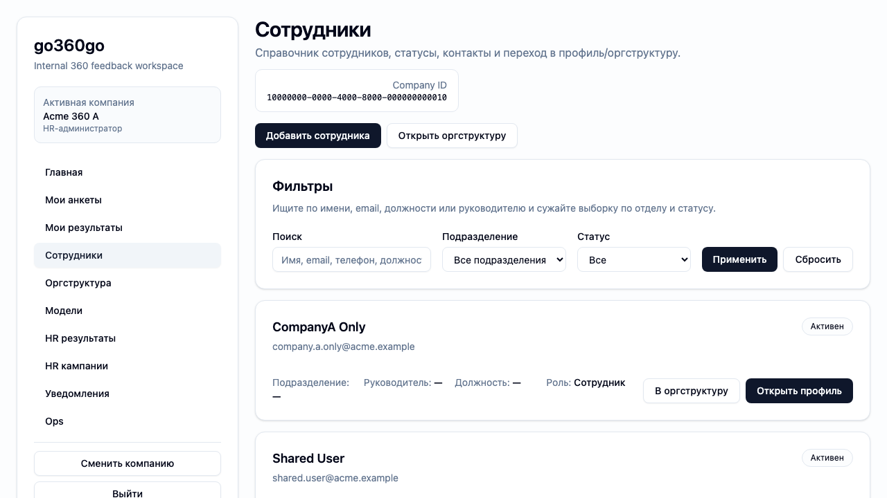
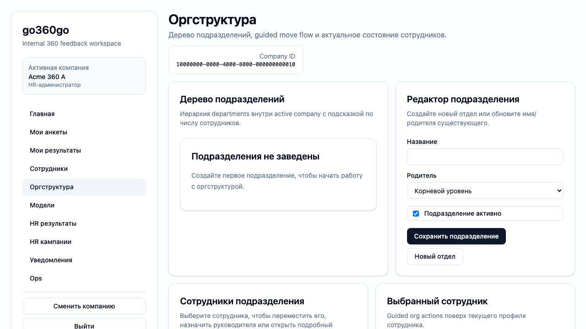
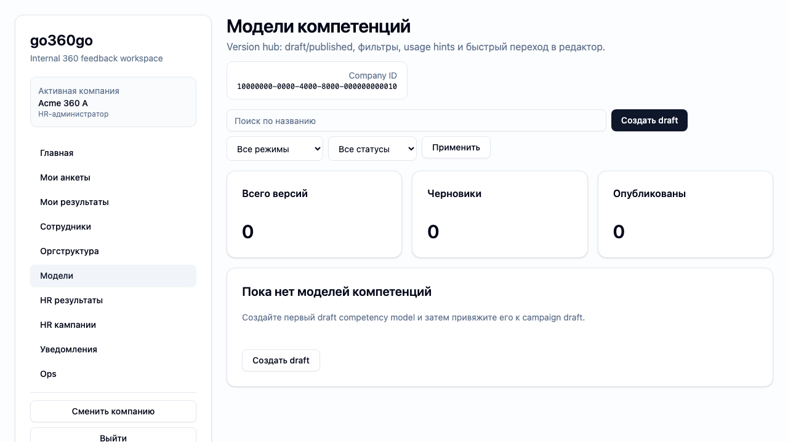
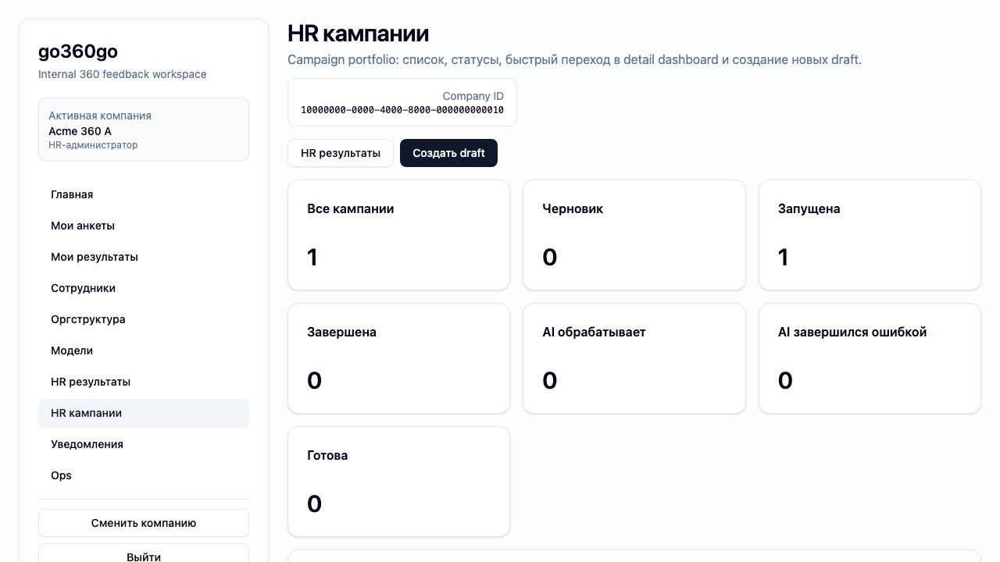

# Tutorial — запустить первую 360-кампанию руками
Status: Draft (2026-03-07)

Этот tutorial показывает продуктовый путь **глазами HR**, а не глазами XE runner.

Его цель — объяснить, как человек вручную проходит через систему:

1. готовит людей и оргконтекст;
2. настраивает модель;
3. создаёт кампанию;
4. запускает её;
5. доводит участников до результатов.

## Для чего этот tutorial

Используй его, когда нужно:

- показать новый продуктовый flow целиком;
- подготовить human-facing документацию для HR;
- понять, какой путь должен пройти пользователь без runner/seed;
- сравнить текущий UI с целевым ручным сценарием.

## Важная оговорка

Это **manual product tutorial**, а не описание `XE-001`.

Различие:

- `XE-001` — reproducible scenario, где setup выполняет runner;
- этот tutorial — описание того, как такой же по смыслу путь должен проходить **человек руками**.

То есть поток похожий, но источник действий другой.

## Целевой путь

### Шаг 1. HR входит в систему

HR открывает приложение, проходит login и попадает в app shell с активной компанией.

На этом шаге пользователь должен:

- успешно войти;
- увидеть роль `HR-администратор`;
- попасть в рабочий контекст компании.

На `beta` сейчас это удобно проверять через demo mode:

1. открыть `https://beta.go360go.ru/auth/login`;
2. нажать `Войти в demo-режиме`;
3. выбрать компанию;
4. попасть на HR home.

Ниже — реальный screenshot такого входа в компании `Acme 360 A`.

### Шаг 2. HR заводит сотрудников

HR открывает справочник сотрудников и:

- добавляет сотрудников;
- задаёт email, телефон и основные атрибуты;
- проверяет, что у участников есть корректные профили.

Результат шага:

- сотрудники заведены в HR-справочнике;
- они готовы к использованию в оргструктуре и кампаниях.

Сейчас в интерфейсе это выглядит так:

### Шаг 3. HR собирает оргструктуру

HR открывает редактор оргструктуры и:

- создаёт подразделения;
- задаёт руководителей;
- привязывает сотрудников к подразделениям;
- формирует управленческие связи.

Результат шага:

- система понимает, кто кому руководитель, кто коллега и кто подчинённый.

Текущий экран оргструктуры:

### Шаг 4. HR создаёт модель компетенций

HR открывает каталог моделей и:

- создаёт draft-версию модели;
- добавляет группы компетенций;
- добавляет компетенции и индикаторы;
- проверяет структуру и публикует модель.

Результат шага:

- есть готовая модель, которую можно привязать к кампании.

Текущий каталог моделей:

### Шаг 5. HR создаёт кампанию

HR открывает раздел кампаний и:

- создаёт draft кампанию;
- выбирает модель;
- задаёт даты;
- проверяет веса и timezone;
- сохраняет draft.

Результат шага:

- появляется кампанию, готовая к старту.

Текущий список HR-кампаний:

### Шаг 6. HR настраивает участников и матрицу

HR добавляет в кампанию сотрудников и проверяет, кто кого оценивает:

- subject;
- руководитель;
- коллеги;
- подчинённые;
- self.

Если включена автогенерация, HR проверяет предложенную матрицу и корректирует её.

Результат шага:

- матрица готова к запуску кампании.

### Шаг 7. HR стартует кампанию

После старта:

- участники получают приглашения;
- кампания переходит в `started`;
- запускается период работы с анкетами.

Результат шага:

- система готова принимать ответы.

### Шаг 8. Участники входят и заполняют анкеты

Сотрудники:

- входят по magic link;
- открывают список анкет;
- сохраняют draft при необходимости;
- отправляют анкеты.

Результат шага:

- кампания получает реальные ответы по всем группам оценивания.

### Шаг 9. Кампания завершается и считаются результаты

После дедлайна или ручного завершения:

- анкеты становятся read-only;
- система считает агрегаты;
- результаты становятся доступны ролям.

### Шаг 10. Роли смотрят результаты

- сотрудник видит свой dashboard;
- руководитель видит team results;
- HR видит полную HR-витрину.

## Что есть уже сейчас

Сейчас в продукте уже есть важные части этого пути:

- employee directory;
- org editor;
- models catalog/editor;
- campaigns list/detail/matrix;
- questionnaire flow;
- results surfaces;
- XE token login для beta scenario runs.

То есть tutorial уже можно наполнять реальными walkthrough-скринами и пошаговыми инструкциями.  
Первые шаги `1–5` уже подтверждены актуальными beta screenshots в demo HR context.

## Как использовать этот tutorial дальше

Этот документ — уже рабочая первая версия manual tutorial.

Дальше его можно развивать по одному шагу:

1. открыть step;
2. пройти его руками;
3. сделать screenshots;
4. добавить “что нажать / что должно получиться”;
5. связать со screen specs и actual routes.

Следующий логичный слой наполнения:

- шаг `6`: participants + matrix;
- шаг `7`: start campaign;
- шаг `8`: questionnaire flow глазами участника;
- шаг `9–10`: завершение кампании и просмотр результатов ролями.

## Связанные документы

- [How `XE-001` works](../explanation/xe-001-walkthrough.md): объясняет похожий по смыслу flow, но через runner. Читать, чтобы не путать manual tutorial и scenario automation.
- [UI sitemap + flows](../../spec/ui/sitemap-and-flows.md): список текущих реализованных поверхностей и planned route groups. Читать, чтобы понимать, на какие реальные экраны можно опираться.
- [UI screen specs](../../spec/ui/screens/index.md): контракты отдельных экранов. Читать, чтобы превращать этот tutorial в точный user flow без догадок.
