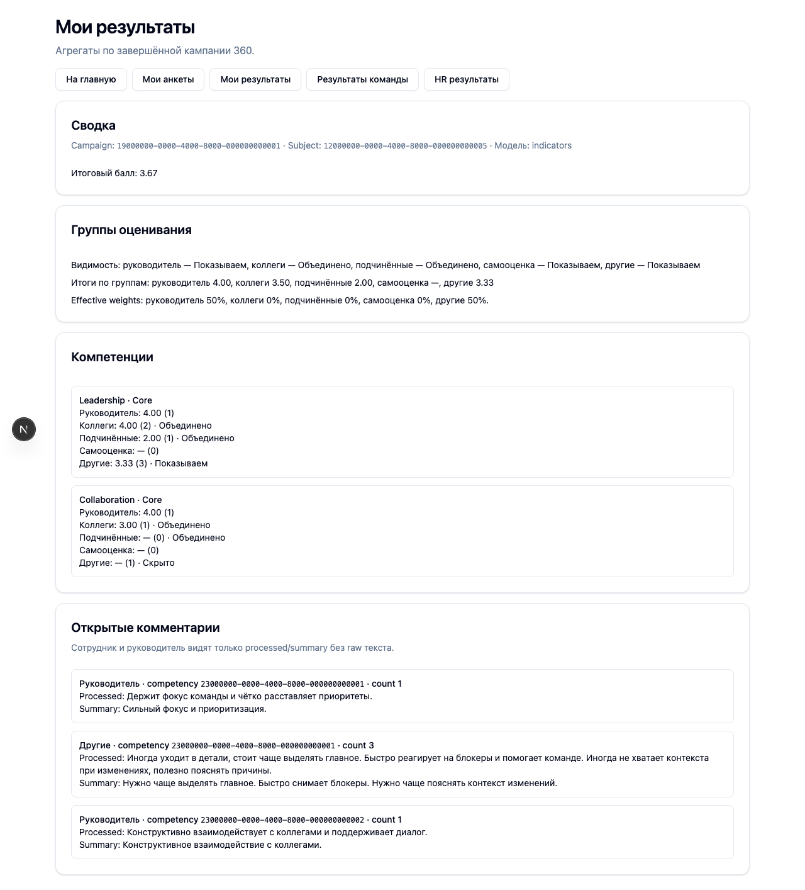
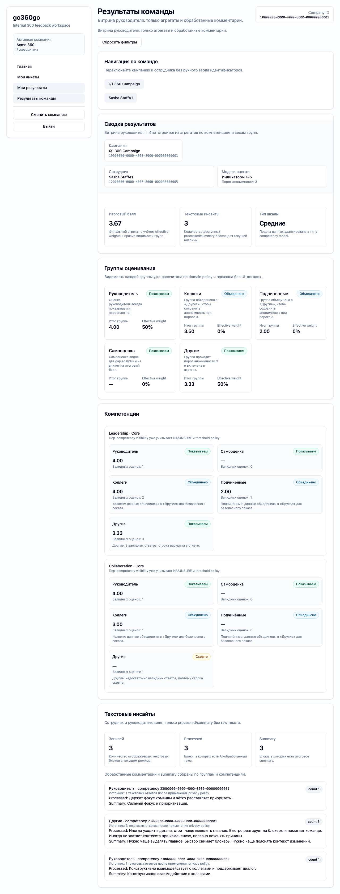

# FT-0083 — Results UI (employee/manager/hr)
Status: Completed (2026-03-05)

## User value
Пользователь видит результаты в своём кабинете; менеджер и HR видят свои витрины.

## Deliverables
- Employee dashboard (calls `results.getMyDashboard`).
- Manager/team view (calls `results.getTeamDashboard`).
- HR results view (calls `results.getHrView`).

## Context (SSoT links)
- [Results visibility](../../../../../spec/domain/results-visibility.md): кто видит raw vs processed. Читать, чтобы UI не пытался показывать “что-то лишнее”.
- [Anonymity policy](../../../../../spec/domain/anonymity-policy.md): hide/merge и edge cases. Читать, чтобы UI показывал “скрыто/объединено” корректно.
- [Implementation playbook](../../../../../plans/implementation-playbook.md): как UI использует typed client и как тестируем. Читать, чтобы UI не содержал доменных правил.
- [Stitch design refs for FT-0083](../../../../../spec/ui/design-references-stitch.md#ft-0083-results-ui): визуальные референсы employee/team dashboard с оговоренными ограничениями. Читать, чтобы сохранить UX и не нарушить privacy rules.

## Acceptance (auto, Playwright)
### Setup
- Seed: `S9_campaign_completed_with_ai`

### Action
1) Под employee открыть results dashboard.
2) Под manager открыть team dashboard.
3) Под hr_admin/hr_reader открыть HR results view.

### Assert
- Employee не видит raw open text.
- Manager не видит raw open text.
- `hr_reader` не видит raw open text.
- `hr_admin` видит raw + processed/summary.

## Implementation plan (target repo)
- Screens:
  - Employee dashboard: `results.getMyDashboard` + визуализация gaps и агрегатов.
  - Manager view: `results.getTeamDashboard` + выбор subject (если нужно).
  - HR view: `results.getHrView`, где `hr_reader` видит processed/summary, а `hr_admin` — raw/processed/summary.
- Тонкие моменты:
  - UI не должен “декодировать” анонимность — он отображает `visibility` флаги из API.
  - Open text: если processed нет — показываем “обработка не завершена”, не raw.

## Tests
- Playwright: под employee открыть dashboard и проверить отсутствие raw полей (через UI assertion или network intercept).
- Playwright: под manager открыть team view и проверить отсутствие raw.
- Playwright: под `hr_reader` открыть HR view и проверить отсутствие raw.
- Playwright: под `hr_admin` открыть HR view и проверить наличие raw+processed.

## Memory bank updates
- Если меняется набор экранов/переходов — обновить: [UI sitemap & flows](../../../../../spec/ui/sitemap-and-flows.md) — SSoT. Читать, чтобы UI соответствовал плану.

## Verification (must)
- Automated test: Playwright assertions по results screens (employee/manager/hr_reader без raw, `hr_admin` с raw).
- Must run: Playwright e2e на seed `S9_campaign_completed_with_ai`.
- При фиксации evidence: для UI шагов добавлять скриншоты и вставлять их в markdown как изображения (``).

## Manual verification (deployed environment)
### Beta scenario A — employee results
- Environment:
  - URL: `https://beta.go360go.ru`
- Preconditions:
  - есть сотрудник с доступными обработанными результатами (`completed` кампания);
  - у результата есть текстовые комментарии (raw + processed в данных).
- Steps:
  1) Войти как `employee` через magic link.
  2) Выбрать компанию.
  3) Открыть экран результатов сотрудника.
  4) Проверить блоки оценок и текстовые комментарии.
- Expected:
  - отображаются агрегаты/метрики;
  - raw open text отсутствует;
  - показываются только разрешённые employee представления (processed/summary).

### Beta scenario B — HR reader results
- Preconditions:
  - есть пользователь роли `hr_reader` в той же компании.
- Steps:
  1) Войти как `hr_reader`.
  2) Открыть HR results view по тому же сотруднику.
  3) Сравнить текстовые блоки с employee view.
- Expected:
  - HR view содержит только processed/summary;
  - employee view не раскрывает raw;
  - отличия в видимости соответствуют policy.

### Beta scenario C — manager team results
- Preconditions:
  - есть пользователь роли `manager`, который управляет `subject` в выбранной кампании.
- Steps:
  1) Войти как `manager`.
  2) Открыть `https://beta.go360go.ru/results/team?campaignId=<campaign_id>&subjectEmployeeId=<subject_employee_id>`.
  3) Проверить текстовые блоки комментариев.
- Expected:
  - manager видит агрегаты и processed/summary комментарии;
  - raw open text отсутствует;
  - при subject вне своей команды backend возвращает `forbidden`.

## Design references (stitch)
- [`stitch_go360go/employee_my_results_report/screen.png`](../../../../../../stitch_go360go/employee_my_results_report/screen.png): employee results dashboard (score, breakdown, AI summary). Используем для структуры личного отчета.
- [`stitch_go360go/_3/screen.png`](../../../../../../stitch_go360go/_3/screen.png): manager/team dashboard с прогрессом и pending actions. Используем как референс руководительского экрана.

## Design constraints (what we do NOT take)
- Не показываем `rawText` на employee/manager экранах даже если референс визуально подразумевает детальные цитаты.
- Не переносим экспорт/report actions, если операция не покрыта контрактом MVP.

## Progress note (2026-03-05)
- Выполнен вертикальный слайс FT-0083:
  - web UI: добавлены страницы `/results`, `/results/team`, `/results/hr`.
  - presentation: добавлены общие секции результатов (`summary`, `group visibility`, `competencies`, `open text`) без доменной логики в компонентах.
  - navigation: на главной странице добавлены ссылки на результаты по ролям.
  - automation: добавлен Playwright сценарий `ft-0083-results-ui.spec.ts` с шагами employee → manager → HR.

## Quality checks evidence (2026-03-05)
- `pnpm --filter @feedback-360/web lint` → passed.
- `pnpm --filter @feedback-360/web typecheck` → passed.
- `set -a; source .env; set +a; pnpm --filter @feedback-360/web test` → passed.
- `set -a; source .env; set +a; pnpm --filter @feedback-360/web build` → passed.

## Acceptance evidence (2026-03-05)
- `set -a; source .env; set +a; cd apps/web && node ../../node_modules/@playwright/test/cli.js test --config playwright/playwright.config.mjs tests/ft-0083-results-ui.spec.ts` → passed.
- Covered acceptance:
  - `S9_campaign_completed_with_ai`: employee dashboard without raw text.
  - `S9_campaign_completed_with_ai`: manager team dashboard without raw text.
  - `S9_campaign_completed_with_ai`: `hr_reader` dashboard without raw text.
  - `S9_campaign_completed_with_ai`: `hr_admin` dashboard with raw + processed + summary text.
- Artifacts:
  - step-01: employee results (без raw).
    
  - step-02: manager team results (без raw).
    
  - step-03: HR results (с raw+processed+summary).
    
