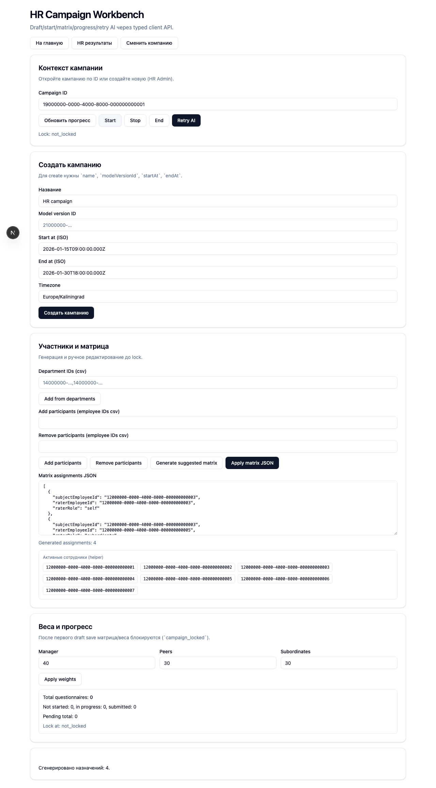
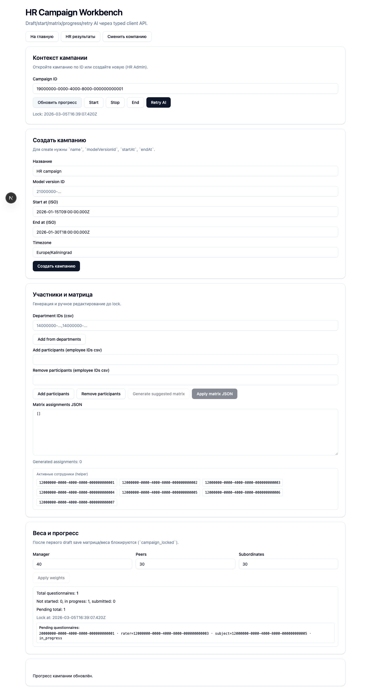
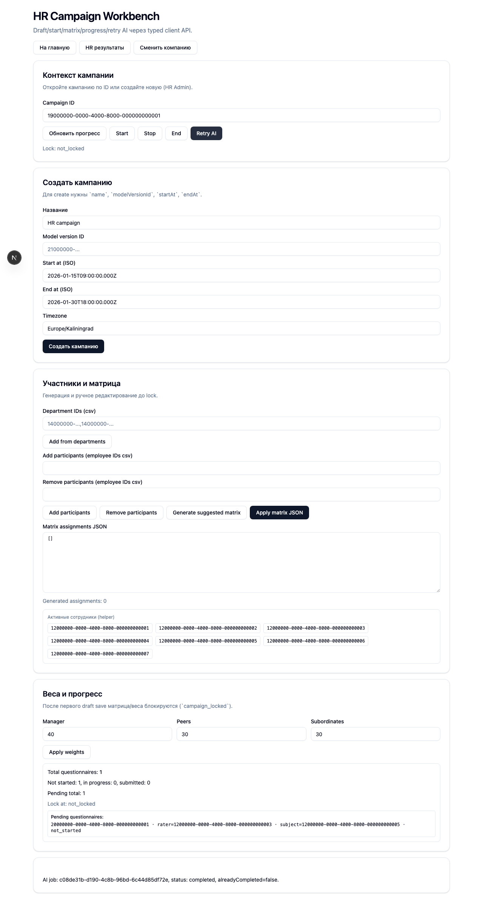

# FT-0084 — HR campaign UI (draft/start/matrix/progress/AI retry)
Status: Completed (2026-03-05)

## User value
HR управляет кампанией: создаёт, настраивает матрицу, запускает, мониторит прогресс, перезапускает AI обработку.

## Deliverables
- Кампании: list/detail; start/stop/end.
- Матрица: generateSuggested + edit до lock.
- Прогресс заполнения: кто что submit’нул.
- Кнопка “retry AI”.

## Context (SSoT links)
- [Campaign lifecycle](../../../../../spec/domain/campaign-lifecycle.md): статусы и запреты. Читать, чтобы UI правильно блокировал действия и показывал статусы.
- [Assignments & matrix](../../../../../spec/domain/assignments-and-matrix.md): edit до lock и правила генерации. Читать, чтобы UI не предлагал “недопустимые” действия.
- [GS5 Lock semantics](../../../../../spec/testing/scenarios/gs5-lock-semantics.md): lock на draft save. Читать, чтобы UI проверял именно agreed freeze-правило.
- [AI processing](../../../../../spec/ai/ai-processing.md): retry AI и статусы. Читать, чтобы UI корректно инициировал запуск и отображал ошибки.
- [Architecture guardrails](../../../../../spec/engineering/architecture-guardrails.md): UI тонкий поверх typed client. Читать, чтобы бизнес-правила не переносились в компоненты.
- [Stitch design refs for FT-0084](../../../../../spec/ui/design-references-stitch.md#ft-0084-hr-campaign-ui): референсы HR campaign/dashboard таблиц и ограничений по scope. Читать, чтобы использовать единый HR UI паттерн без выхода в non-MVP функции.

## Acceptance (auto, Playwright)
### Setup
- Seed: `S4_campaign_draft`

### Action
1) Создать/открыть кампанию.
2) Сгенерировать матрицу, отредактировать.
3) Стартовать кампанию.
4) Сделать draft save в анкете (любой rater) → lock.
5) Попробовать изменить матрицу/веса из HR UI.

### Assert
- UI блокирует запрещённые действия.
- Backend возвращает typed error `code=campaign_locked`.

## Implementation plan (target repo)
- Screens:
  - Campaign list/detail: таблица кампаний, страница кампании с вкладками (participants/matrix/progress).
  - Actions: start/stop/end вызывают соответствующие ops.
  - Matrix: вызвать `matrix.generateSuggested`, показать diff и позволить ручной edit до lock (`matrix.set`).
  - Progress: список назначений/анкет со статусами (нужен read op, возможно отдельная операция позже).
  - AI retry: кнопка вызывает `ai.runForCampaign` (или отдельный `ai.retryForCampaign`, если введём).
- Тонкие моменты:
  - После lock (draft save) UI должен:
    - скрыть/заблокировать элементы редактирования матрицы/весов,
    - корректно обработать typed error `campaign_locked` (на случай гонок).

## Tests
- Playwright: HR создаёт/открывает кампанию → generate matrix → start → lock trigger (draft save) → попытка изменить матрицу → ожидание блокировки/ошибки.

## Memory bank updates
- Если добавляем новые HR экраны/флоу — обновить: [UI sitemap & flows](../../../../../spec/ui/sitemap-and-flows.md) — SSoT. Читать, чтобы UI не “убегал” от плана.

## Verification (must)
- Automated test: Playwright HR flow (draft → matrix generate/edit → start → lock → попытка изменить matrix/weights).
- Must run: Playwright e2e (GS1 minimal) + lock semantics UI assertion (можно как часть GS1).
- При фиксации evidence: для UI шагов добавлять скриншоты и вставлять их в markdown как изображения (``).

## Manual verification (deployed environment)
### Beta scenario A — draft/start/matrix
- Environment:
  - URL: `https://beta.go360go.ru`
- Preconditions:
  - есть пользователь роли `hr_admin`;
  - есть кампания в `draft` с участниками и моделью;
  - доступны операции генерации матрицы.
- Steps:
  1) Войти как `hr_admin`.
  2) Открыть кампанию в статусе `draft`.
  3) Сгенерировать матрицу оценщиков.
  4) Изменить матрицу вручную (добавить/удалить назначение).
  5) Стартовать кампанию.
- Expected:
  - до старта матрица редактируется;
  - после старта модель/состав участников изменять нельзя;
  - статус кампании переключается в `started`.

### Beta scenario B — lock after first draft save
- Preconditions:
  - в `started` кампании любой оценивающий сохранил `draft` (это триггер lock).
- Steps:
  1) Обновить страницу кампании HR.
  2) Попробовать изменить матрицу или веса.
- Expected:
  - UI блокирует действия редактирования;
  - при форсированном запросе backend возвращает typed error `campaign_locked`;
  - в UI отображается понятное сообщение о блокировке.

### Beta scenario C — AI retry button
- Preconditions:
  - кампания в `ai_failed` или состояние допускает retry согласно policy.
- Steps:
  1) Нажать `Retry AI`.
  2) Обновить страницу статусов.
- Expected:
  - запускается новый AI job;
  - статус переходит в `processing_ai` (далее — по webhook).

## Design references (stitch)
- [`stitch_go360go/hr_admin_campaign_dashboard/screen.png`](../../../../../../stitch_go360go/hr_admin_campaign_dashboard/screen.png): HR campaign dashboard (статусы, прогресс, actions). Используем как референс основной кампанийной панели.
- [`stitch_go360go/hr_admin_employee_directory/screen.png`](../../../../../../stitch_go360go/hr_admin_employee_directory/screen.png): HR table/list паттерны (фильтры, таблица, status chips). Используем для унификации HR list/detail экранов.

## Design constraints (what we do NOT take)
- Не берем non-MVP действия (`Export`, внешние отчеты, payroll-элементы) до появления соответствующих операций в контракте.
- Не переносим демо-правила действий: доступность кнопок определяется только нашими lifecycle/matrix lock инвариантами.

## Progress note (2026-03-05)
- Выполнен вертикальный слайс FT-0084:
  - web UI: добавлен экран `/hr/campaigns` с workbench для кампаний.
  - transport: добавлен route-handler `/api/hr/campaigns/execute` (тонкий adapter к typed operations).
  - actions: create/start/stop/end, matrix generate/apply, participants, weights, progress, AI retry.
  - lock UX: после первого draft-save блокируются matrix/weights кнопки и показывается lock state.
  - automation: добавлен Playwright сценарий `ft-0084-hr-campaign-ui.spec.ts`.

## Quality checks evidence (2026-03-05)
- `set -a; source .env; set +a; pnpm --filter @feedback-360/web lint` → passed.
- `set -a; source .env; set +a; pnpm --filter @feedback-360/web typecheck` → passed.
- `set -a; source .env; set +a; pnpm --filter @feedback-360/web test` → passed.
- `set -a; source .env; set +a; pnpm --filter @feedback-360/web build` → passed.

## Acceptance evidence (2026-03-05)
- `set -a; source .env; set +a; cd apps/web && node ../../node_modules/@playwright/test/cli.js test --config playwright/playwright.config.mjs tests/ft-0084-hr-campaign-ui.spec.ts` → passed.
- Covered acceptance:
  - `S4_campaign_draft`: HR открывает workbench, добавляет participants, генерирует/применяет матрицу, стартует кампанию.
  - `S5_campaign_started_no_answers`: после первого `questionnaire.saveDraft` кампания lock-ится; matrix/weights блокируются; форс-запрос `campaign.weights.set` возвращает `409` + `campaign_locked`.
  - `S8_campaign_ended`: кнопка `Retry AI` запускает `ai.runForCampaign`.
- Artifacts:
  - step-01: draft/start/matrix.
    
  - step-02: locked campaign (matrix/weights blocked).
    
  - step-03: AI retry from ended campaign.
    
