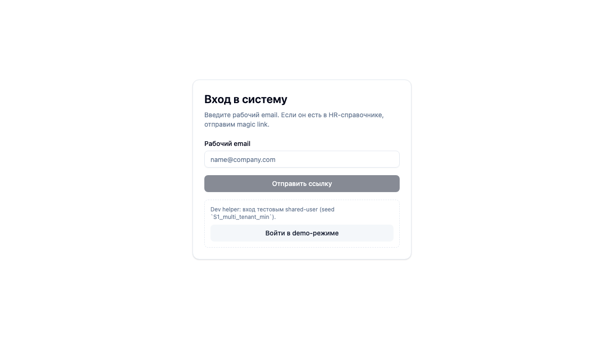
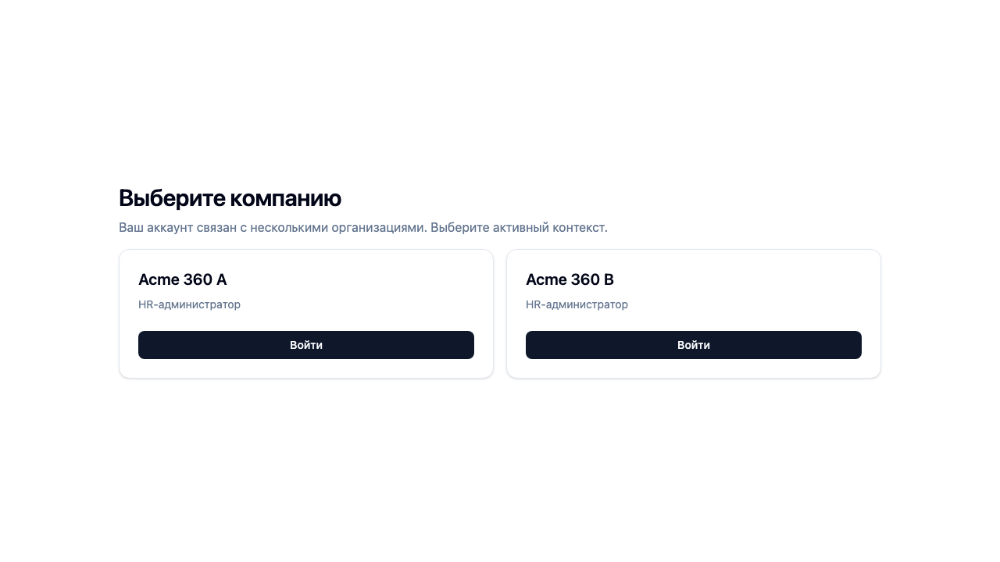

# FT-0093 — Beta smoke release gates
Status: Completed (2026-03-05)

## User value
После деплоя на `beta` у нас есть не только “зелёный билд”, но и подтверждение, что ключевые пользовательские сценарии реально живы на настоящем окружении.

## Deliverables
- Каталог обязательных `beta` smoke flows для runtime/user-facing изменений.
- Стандарт прогона через browser automation и хранения screenshot evidence.
- Release rule: user-facing фича не считается закрытой без beta smoke (где применимо).

## Context (SSoT links)
- [Runbook](../../../../../spec/operations/runbook.md): текущий deploy/smoke baseline. Читать, чтобы не дублировать release process.
- [Delivery standards](../../../../../spec/engineering/delivery-standards.md): обязательность deploy evidence. Читать, чтобы smoke стал частью DoD.
- [UI sitemap & flows](../../../../../spec/ui/sitemap-and-flows.md): какие user flows критичны. Читать, чтобы smoke покрывал реальные сценарии, а не случайные страницы.

## Acceptance (auto)
### Setup
- Изменение задеплоено на `https://beta.go360go.ru`.
- Есть smoke-аккаунты/seed данные для критичных ролей.

### Action
1) Прогнать agreed smoke flow(s) через browser automation.
2) Сохранить screenshots/logs.
3) Записать evidence в FT-doc + verification matrix.

### Assert
- Smoke зелёный на реальном `beta`.
- Evidence приложен в markdown как изображения.
- Release gate зафиксирован в стандартах и повторяем агентом.

## Implementation plan (target repo)
- Зафиксировать список обязательных smoke flow categories:
  - auth/company switch,
  - questionnaire path,
  - results visibility,
  - HR campaign path.
- Определить, какие фичи требуют `beta` smoke обязательно.
- Нормализовать naming и storage screenshots under `.memory-bank/evidence/`.
- Обновить docs и feature template.

## Tests
- Browser smoke on `beta`.
- Regression: хотя бы один runtime PR подтверждает прохождение нового gate.

## Memory bank updates
- Обновить [Runbook](../../../../../spec/operations/runbook.md), [Delivery standards](../../../../../spec/engineering/delivery-standards.md), [Feature template](../../../../feature-template.md) если меняется обязательность evidence.

## Verification (must)
- Automated/browser check: smoke against `beta`.
- Must run: минимум один auth flow и один domain flow на реальном deploy.

## Manual verification (deployed environment)
- Environment:
  - URL: `https://beta.go360go.ru`
  - Date: `2026-03-05`
- Steps:
  1. Открыть `https://beta.go360go.ru/auth/login`.
  2. Убедиться, что форма входа рендерится и доступна кнопка `Войти в demo-режиме`.
  3. Нажать `Войти в demo-режиме` и дождаться перехода на `/select-company`.
  4. Зафиксировать скриншоты login и select-company.
- Expected:
  - login screen доступен на реальном `beta`;
  - demo flow доходит до `select-company`;
  - evidence приложен в FT markdown и verification matrix.

## Quality checks evidence (2026-03-05)
- Checks run:
  - `pnpm checks`
  - `PLAYWRIGHT_BASE_URL=https://beta.go360go.ru pnpm --filter @feedback-360/web test:smoke:beta`
- Result:
  - passed; для remote beta smoke повышен timeout до `90s`, чтобы исключить ложные fail на seed/runtime latency.

## Acceptance evidence (2026-03-05)
- Commands/tests run:
  - `PLAYWRIGHT_BASE_URL=https://beta.go360go.ru pnpm --filter @feedback-360/web test:smoke:beta`
  - `$agent-browser`: `open -> snapshot -i -> screenshot`, затем demo login и screenshot на `select-company`
- Result:
  - passed; beta smoke suite закрывает auth/company switch, questionnaire draft, results visibility и HR workbench;
  - manual browser spot-check подтверждает живой auth flow на `beta`.
- Artifacts:
  - `../../../../../evidence/EP-009/FT-0093/2026-03-05/step-01-beta-login.png` — login screen на `beta`
  - `../../../../../evidence/EP-009/FT-0093/2026-03-05/step-02-beta-select-company.png` — select-company после demo login
  - 
  - 

## CI/CD evidence
- GitHub:
  - Workflow dispatch run: `https://github.com/deksden-com/feedback-360/actions/runs/22738351836`
  - Status: `success`
- Vercel:
  - beta domain health target: `https://beta.go360go.ru/api/health`
  - preview deployment used for PR validation: `https://go360go-beta-qjzyzd712-deksdens-projects.vercel.app`
- Root cause before fix:
  - remote smoke suite had false timeouts on heavier seeded scenarios `S5`/`S9` under default `30s`;
  - fixed by making `test:smoke:beta` explicitly run with `--timeout=90000`.
