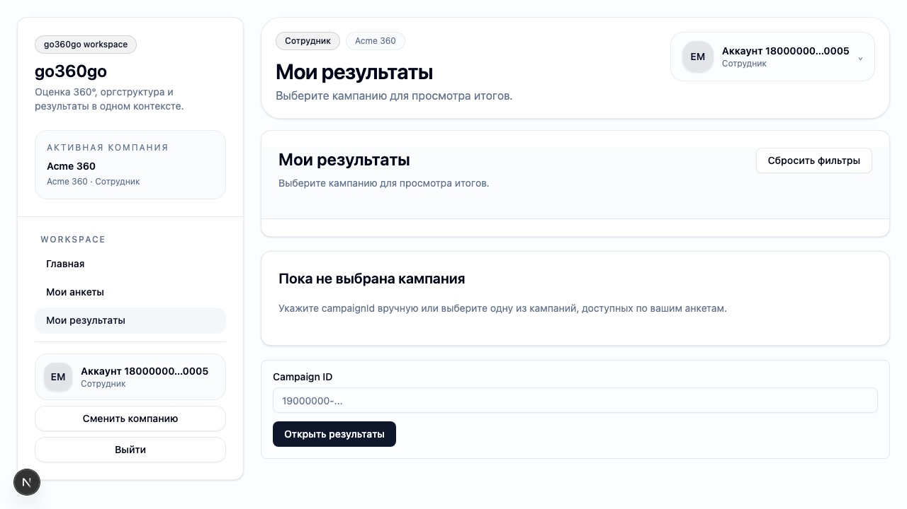
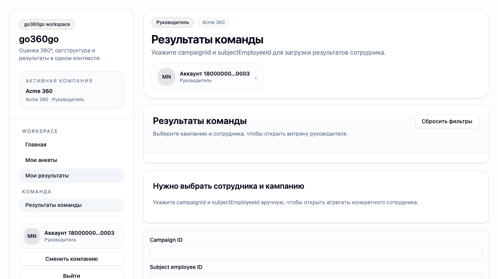
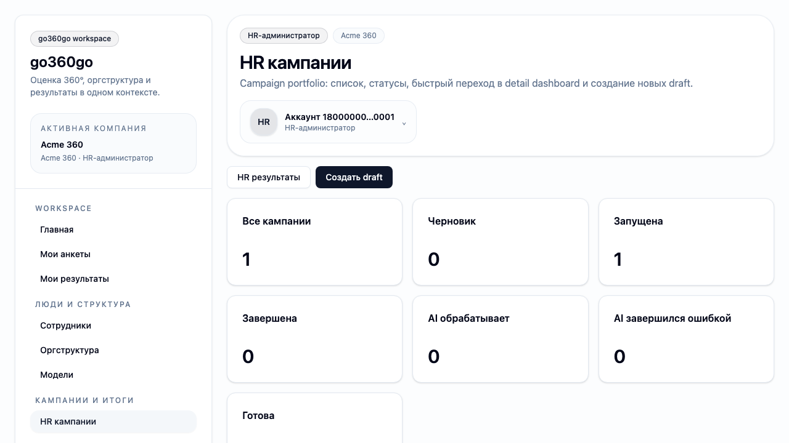

# FT-0111 — Internal app shell
Status: Completed (2026-03-06)

## User value
HR, manager и employee работают внутри единого интерфейса с понятной навигацией и стабильным company context.

## Deliverables
- `AppShell` для внутренних маршрутов.
- Role-aware navigation config.
- Shared header/sidebar, company switcher slot, sign-out slot.

## Context (SSoT links)
- [UI sitemap & flows](../../../../../spec/ui/sitemap-and-flows.md): целевая карта внутренних экранов и route groups. Читать, чтобы shell не создавал “лишних” путей.
- [Architecture guardrails](../../../../../spec/engineering/architecture-guardrails.md): thin UI и запрет доменной логики в компонентах. Читать, чтобы shell остался presentation-only слоем.
- [Stitch mapping — EP-011](../../../../../spec/ui/design-references-stitch.md#ep-011--app-shell-and-navigation): visual references для shell/dashboard composition. Читать, чтобы взять layout и hierarchy, но не поведение.

## Project grounding
- Прочитать [EP-011](../../index.md) и [feature catalog](../index.md) целиком.
- Свериться с текущими маршрутами `apps/web/src/app/*`, чтобы сохранить совместимость существующего MVP UI.
- Проверить `typed client`/route handler boundaries перед переносом навигации в shell.

## Implementation plan
- Вынести внутренние страницы под общий route group/layout.
- Собрать статический nav config с привязкой к ролям и существующим маршрутам.
- Сохранить active company context и flash messages между переходами.

## Scenarios (auto acceptance)
### Setup
- Seed: `S1_multi_tenant_min` или `S1_company_roles_min`.
- Actors: `employee`, `manager`, `hr_admin`.

### Action
1. Войти, выбрать компанию.
2. Открыть `Questionnaires`, `Results`, `HR Campaigns`.
3. Вернуться на home и выйти.

### Assert
- Shell сохраняется между переходами.
- Active company не теряется.
- Primary nav не показывает недоступные разделы.

### Client API ops (v1)
- `membership.list`, session/auth routes, existing page loaders.

## Manual verification (deployed environment)
- `beta`: login → select company → пройтись по основным пунктам меню → sign out.
- Expected: внутренние страницы открываются в одном shell, без “голых” страниц.

## Docs updates (SSoT)
- [UI sitemap & flows](../../../../../spec/ui/sitemap-and-flows.md)
- [Design references (stitch)](../../../../../spec/ui/design-references-stitch.md)

## Progress note (2026-03-06)
- Выполнен вертикальный слайс FT-0111:
  - добавлен `InternalAppShell` для внутренних маршрутов employee/manager/HR;
  - вынесен role-aware nav config и loader meta по active company;
  - текущие MVP-страницы (`/`, `/questionnaires`, `/results*`, `/hr/campaigns`) переведены на общий shell без переноса бизнес-логики в UI;
  - добавлен Playwright acceptance `ft-0111-app-shell.spec.ts` с тремя ролями и screenshot evidence.

## Quality checks evidence (2026-03-06)
- `pnpm --filter @feedback-360/web lint` → passed.
- `pnpm --filter @feedback-360/web typecheck` → passed.
- `pnpm --filter @feedback-360/web test` → passed.
- `pnpm --filter @feedback-360/web build` → passed (с известными Sentry/OpenTelemetry warnings, без build failure).

## Acceptance evidence (2026-03-06)
- `cd apps/web && node ../../node_modules/@playwright/test/cli.js test --config playwright/playwright.config.mjs tests/ft-0111-app-shell.spec.ts --reporter=line` → passed.
- Covered acceptance:
  - `S7_campaign_started_some_submitted`: employee открывает workspace и questionnaires внутри общего shell.
  - `S7_campaign_started_some_submitted`: manager видит `Results team`, не видит HR navigation.
  - `S7_campaign_started_some_submitted`: HR admin видит `HR results` и `HR campaigns`, company context сохраняется между переходами.
- Artifacts:
  - step-01: employee home shell.
    
  - step-02: results shell.
    
  - step-03: manager team results shell.
    
  - step-04: HR campaigns shell.
    

## Manual verification (deployed environment)
### Beta scenario — internal shell for real HR account
- Environment:
  - URL: `https://beta.go360go.ru`
  - account: `deksden@deksden.com` (HR admin)
- Steps:
  1. Войти по magic link.
  2. Если открылся `select-company`, выбрать рабочую компанию.
  3. Перейти на `/`, затем открыть `HR результаты` и `HR кампании`.
  4. Нажать `Сменить компанию`, затем вернуться в активную компанию.
- Expected:
  - страницы открываются внутри общего shell;
  - имя активной компании видно в sidebar/top card;
  - HR navigation присутствует, employee/manager-only пункты не появляются дополнительно;
  - sign out и company switch доступны из shell.
