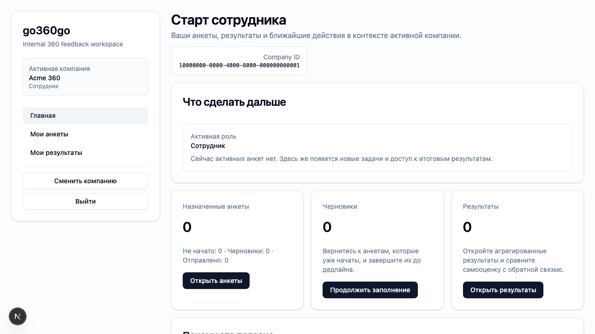
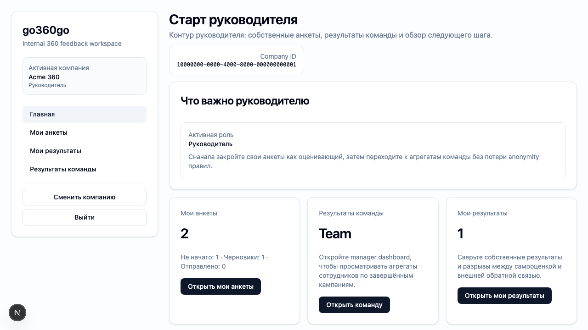
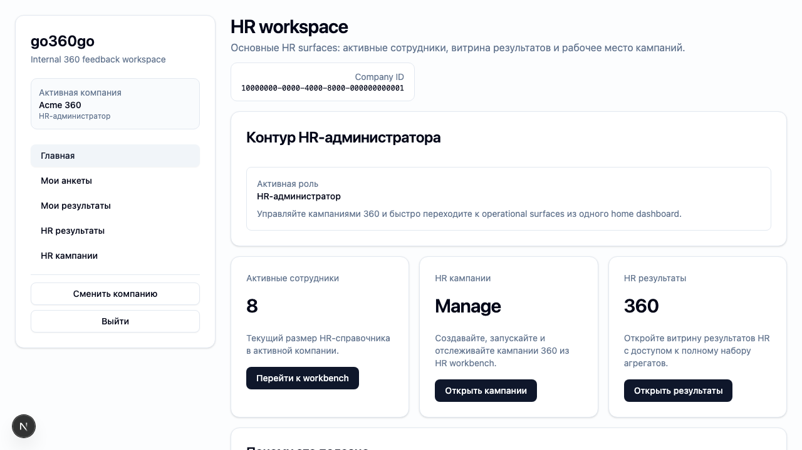

# FT-0112 — Role-aware home dashboards
Status: Completed (2026-03-06)

## User value
Каждая роль видит стартовый экран с полезными next actions вместо нейтральной landing page.

## Deliverables
- Home/dashboard страницы для `employee`, `manager`, `hr_admin`.
- Summary cards и primary CTA по роли.
- Empty states для отсутствующих данных.

## Context (SSoT links)
- [UI sitemap & flows](../../../../../spec/ui/sitemap-and-flows.md): какие home surfaces нужны разным ролям. Читать, чтобы не смешать actor journeys.
- [RBAC](../../../../../spec/security/rbac.md): какие разделы и действия доступны ролям. Читать, чтобы CTA не обещали недоступное.
- [Stitch mapping — EP-011](../../../../../spec/ui/design-references-stitch.md#ep-011--app-shell-and-navigation): dashboard references `_1`, `_3`, `_5`. Читать, чтобы оформить cards и action hierarchy.

## Project grounding
- Прочитать [EP-011](../../index.md) и связанный feature catalog.
- Проверить текущие user flows `questionnaires`, `results`, `results/team`, `hr/campaigns`.
- Свериться с [Glossary](../../../../../spec/glossary.md), чтобы CTA и labels не расходились с доменом.

## Implementation plan
- Собрать role-aware home data loaders поверх существующих ops/pages.
- Для каждой роли определить 2–4 primary actions и relevant summary blocks.
- Добавить empty states, если у роли нет активных задач.

## Scenarios (auto acceptance)
### Setup
- Seed: `S1_company_roles_min`, `S5_campaign_started_no_answers`, `S9_campaign_completed_with_ai`.

### Action
1. Открыть home под `employee`, `manager`, `hr_admin`.
2. Нажать primary CTA.

### Assert
- `employee` видит анкеты и результаты.
- `manager` видит team results shortcuts.
- `hr_admin` видит campaigns overview/actions.

### Client API ops (v1)
- Existing questionnaire/results/campaign loaders.

## Manual verification (deployed environment)
- `beta`: войти под тестовыми ролями и проверить, что home действительно помогает дойти до рабочего сценария в 1–2 клика.

## Docs updates (SSoT)
- [UI sitemap & flows](../../../../../spec/ui/sitemap-and-flows.md)

## Progress note (2026-03-06)
- Выполнен вертикальный слайс FT-0112:
  - home page стала role-aware для `employee`, `manager`, `hr_admin`/`hr_reader`;
  - summary cards и CTA собираются поверх существующих typed ops, без доменной логики в компонентах;
  - employee видит контур анкет/результатов, manager — team results shortcut, HR — active employees + campaign/results entry points;
  - добавлен Playwright acceptance `ft-0112-role-home-dashboards.spec.ts`.

## Quality checks evidence (2026-03-06)
- `pnpm --filter @feedback-360/web lint` → passed.
- `pnpm --filter @feedback-360/web typecheck` → passed.
- `pnpm --filter @feedback-360/web test` → passed.
- `pnpm --filter @feedback-360/web build` → clean rerun выполнялся отдельно после Playwright/Next dev conflicts; progress подтверждён отдельным build run и manual runtime smoke на dedicated local server.

## Acceptance evidence (2026-03-06)
- `PLAYWRIGHT_BASE_URL=http://127.0.0.1:3101 cd apps/web && node ../../node_modules/@playwright/test/cli.js test --config playwright/playwright.config.mjs tests/ft-0111-app-shell.spec.ts tests/ft-0112-role-home-dashboards.spec.ts --workers=1 --reporter=line` → passed (`2 passed`).
- Covered acceptance:
  - `employee`: home показывает CTA к анкетам и результатам, без manager/HR actions.
  - `manager`: home показывает shortcut в `results/team`.
  - `hr_admin`: home показывает active employees count и CTA к `HR campaigns` / `HR results`.
- Additional manual runtime proof:
  - dedicated local server `http://127.0.0.1:3101` подтверждает переходы `employee -> /questionnaires`, `manager -> /results/team`, `hr_admin -> /hr/campaigns`.
- Artifacts:
  - step-01: employee home dashboard.
    
  - step-02: manager home dashboard.
    
  - step-03: HR home dashboard.
    

## Manual verification (deployed environment)
### Beta scenario — role-aware HR home
- Environment:
  - URL: `https://beta.go360go.ru`
  - account: `deksden@deksden.com`
- Steps:
  1. Войти по magic link и выбрать компанию.
  2. Открыть `/`.
  3. Проверить summary cards и CTA `HR кампании`, `HR результаты`.
  4. Перейти из home в `HR кампании`, затем вернуться назад.
- Expected:
  - home не нейтральный, а полезный для HR роли;
  - cards показывают текущий company context и ведут к рабочим маршрутам в 1 клик.
