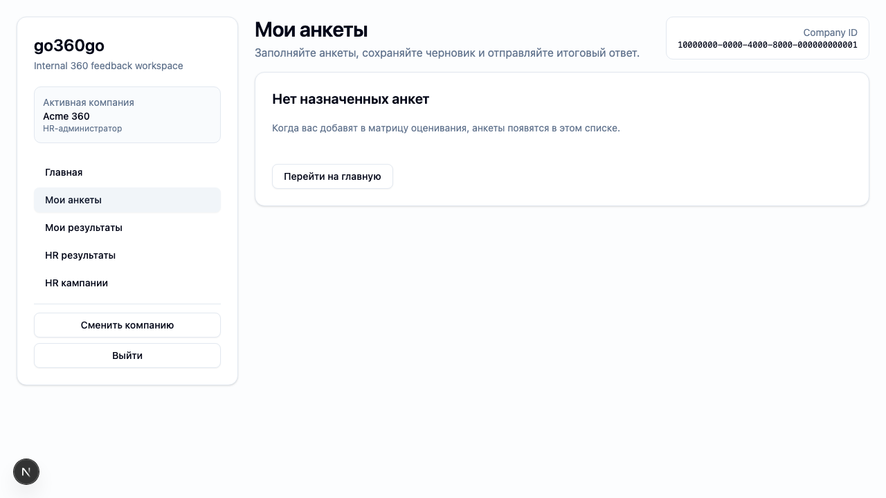
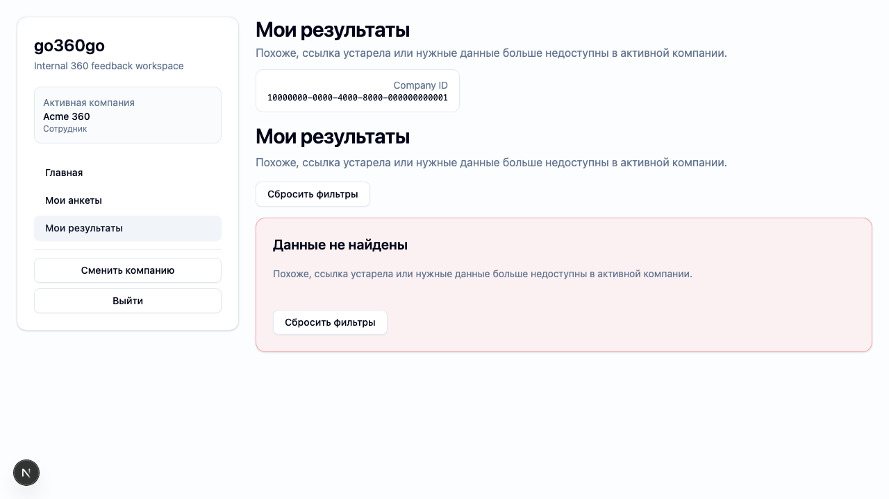

# FT-0113 — Shared loading, empty and error states
Status: Completed (2026-03-06)

## User value
Пользователь понимает, что происходит при пустых данных, задержке или ошибке, и не сталкивается с “сырой” технической выдачей.

## Deliverables
- Shared skeleton/loading blocks.
- Empty states с пояснением и CTA.
- Error states с retry/back actions.

## Context (SSoT links)
- [Delivery standards](../../../../../spec/engineering/delivery-standards.md): для user-facing фич нужны beta verification и evidence. Читать, чтобы сразу проектировать проверяемые states.
- [Testing standards](../../../../../spec/engineering/testing-standards.md): где и как проверять UI states. Читать, чтобы выбрать правильный mix component/e2e tests.
- [Stitch mapping — EP-011](../../../../../spec/ui/design-references-stitch.md#ep-011--app-shell-and-navigation): карточная композиция и spacing. Читать, чтобы shared states были визуально консистентны.

## Project grounding
- Проверить текущие pages и какие ошибки/empty states уже существуют.
- Согласовать тексты и CTA со словарём и текущими flows.

## Implementation plan
- Вынести shared state components.
- Подключить их к questionnaire/results/hr pages.
- Добавить error-safe handling для route loaders/forms.

## Scenarios (auto acceptance)
### Setup
- Seed: `S0_empty`, `S1_company_min`, forced error mocks.

### Action
1. Открыть пустые страницы.
2. Сымитировать backend error.

### Assert
- Empty state объясняет next step.
- Error state показывает friendly message без stack trace/SQL.
- Retry/back actions доступны.

### Client API ops (v1)
- Existing page loaders and route handlers with controlled error responses.

## Manual verification (deployed environment)
- `beta`: открыть пустые states и ошибочные переходы по прямой ссылке; убедиться, что UI остаётся дружелюбным.

## Docs updates (SSoT)
- [UI sitemap & flows](../../../../../spec/ui/sitemap-and-flows.md)

## Progress note (2026-03-06)
- Выполнен вертикальный слайс FT-0113:
  - добавлены shared компоненты `PageLoadingState`, `PageEmptyState`, `PageErrorState`, `InlineBanner`;
  - внутренние страницы `/`, `/questionnaires`, `/questionnaires/[questionnaireId]`, `/results*`, `/hr/campaigns`, `/select-company` переведены на дружелюбные empty/error states без raw backend сообщений;
  - добавлен controlled query param `debugDelayMs` для воспроизводимого loading-state acceptance и ручной beta-проверки;
  - добавлен Playwright acceptance `ft-0113-shared-states.spec.ts` со screenshot evidence.

## Quality checks evidence (2026-03-06)
- `pnpm --filter @feedback-360/web lint` → passed.
- `pnpm --filter @feedback-360/web typecheck` → passed.
- `pnpm --filter @feedback-360/web test` → passed.
- `pnpm --filter @feedback-360/web build` → passed (с известными Sentry/OpenTelemetry warnings, без build failure).

## Acceptance evidence (2026-03-06)
- `PLAYWRIGHT_BASE_URL=http://127.0.0.1:3101 cd apps/web && node ../../node_modules/@playwright/test/cli.js test --config playwright/playwright.config.mjs tests/ft-0113-shared-states.spec.ts --workers=1 --reporter=line` → passed (`3 passed`).
- Covered acceptance:
  - `S1_company_min`: `/questionnaires` показывает empty state с пояснением и CTA.
  - `S7_campaign_started_some_submitted`: `/results?campaignId=00000000-0000-0000-0000-000000000000` показывает friendly error state без raw backend details.
  - `S1_company_min`: delayed navigation `/questionnaires?debugDelayMs=1500` показывает shared loading state.
- Artifacts:
  - step-01: questionnaires empty state.
    
  - step-02: results error state.
    
  - step-03: shared loading state.
    

## Manual verification (deployed environment)
### Beta scenario — shared states on real environment
- Environment:
  - URL: `https://beta.go360go.ru`
  - account: `deksden@deksden.com`
- Steps:
  1. Войти по magic link и выбрать активную компанию.
  2. Открыть `/results` без параметров и проверить empty state с form-блоком выбора `campaignId`.
  3. Открыть `/results?campaignId=00000000-0000-0000-0000-000000000000` и проверить friendly error state без SQL/stack trace.
  4. Уже из активной сессии открыть `/questionnaires?debugDelayMs=1500` и убедиться, что на переходе показывается общий loading state.
- Expected:
  - empty state объясняет, что делать дальше;
  - error state не показывает raw backend message;
  - loading state визуально совпадает с общим card-based language shell.
