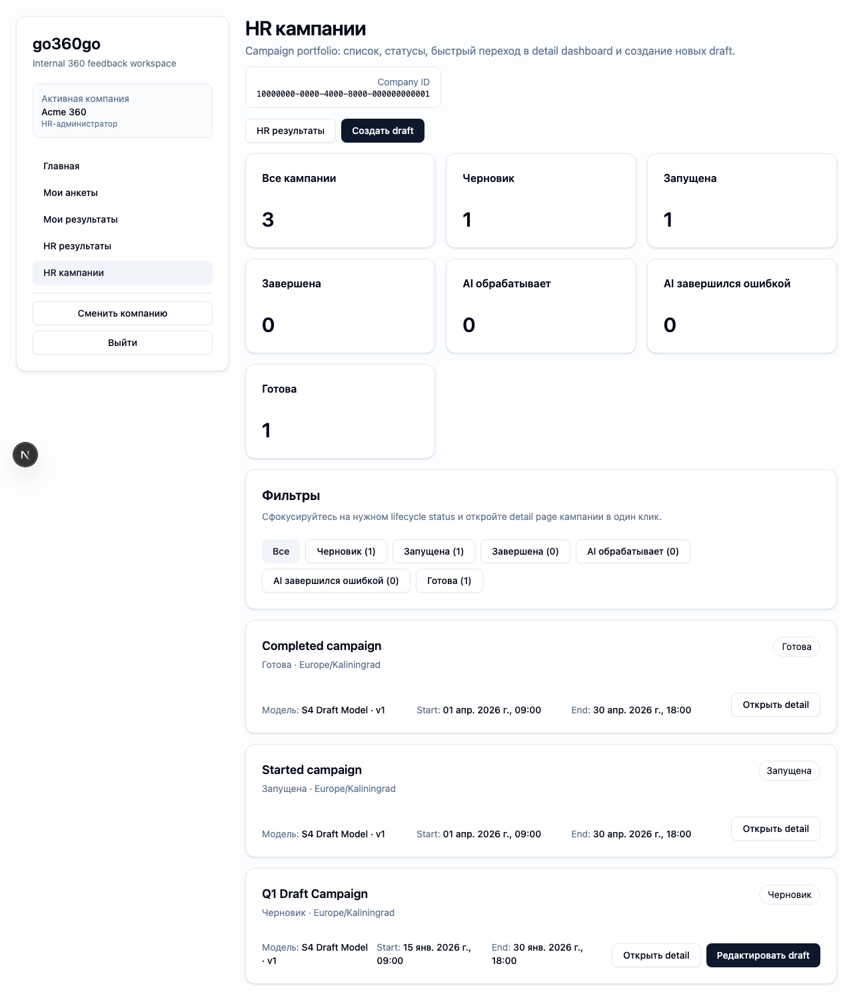
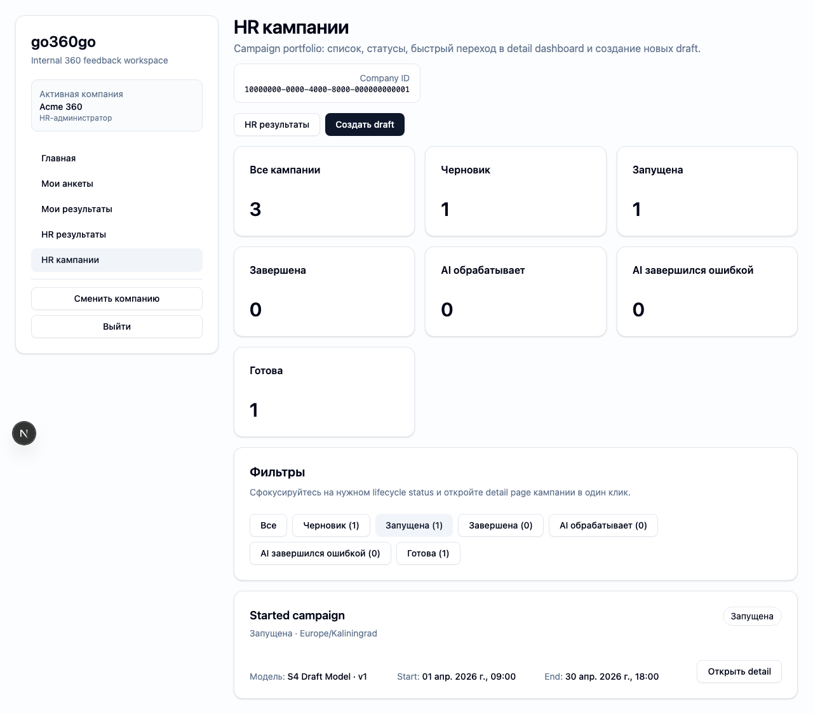
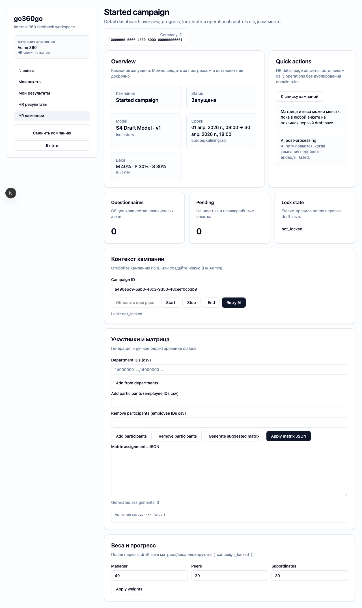

# FT-0121 — Campaign list and filters
Status: Completed (2026-03-06)

## User value
HR быстро находит нужную кампанию по статусу и срокам, не работая через одну перегруженную операционную страницу.

## Deliverables
- Campaigns list view.
- Filters by status within active company context.
- Summary counters and links to detail page.

## Context (SSoT links)
- [Campaign lifecycle](../../../../../spec/domain/campaign-lifecycle.md): статусы и допустимые transitions. Читать, чтобы list/filter корректно отражал state machine.
- [UI sitemap & flows](../../../../../spec/ui/sitemap-and-flows.md): плановые HR campaign surfaces. Читать, чтобы list был частью цельного IA.
- [Stitch mapping — EP-012](../../../../../spec/ui/design-references-stitch.md#ep-012--hr-campaigns-ux): reference для stat cards и campaign list layout.

## Project grounding
- Прочитать [EP-012](../../index.md) и текущий `/hr/campaigns`.
- Проверить существующие filters/commands для campaigns в core/client/CLI.

## Implementation plan
- Добавить отдельный list/dashboard слой перед detail workbench.
- Собирать counters и list items из typed data loaders.
- Сохранить company scoping и compatible deep links.

## Scenarios (auto acceptance)
### Setup
- Seed: `S4_campaign_draft`, `S5_campaign_started_no_answers`, `S8_campaign_ended`, `S9_campaign_completed_with_ai`.

### Action
1. Открыть campaigns list.
2. Фильтровать по status.
3. Открыть одну кампанию.

### Assert
- Counters совпадают с seed.
- Фильтры deterministic.
- Detail page открывается в контексте active company.

### Client API ops (v1)
- Existing campaign list/detail loaders.

## Manual verification (deployed environment)
- `beta`: войти как `hr_admin`, открыть campaigns list, фильтровать по status и открыть detail page.

## Docs updates (SSoT)
- [UI sitemap & flows](../../../../../spec/ui/sitemap-and-flows.md)

## Progress note (2026-03-06)
- Выполнен вертикальный слайс FT-0121:
  - добавлены typed operations `model.version.list`, `campaign.list`, `campaign.get` и CLI команды `model version list`, `campaign list`, `campaign get`;
  - `/hr/campaigns` превратился в HR list/dashboard со status counters, фильтрами и deep links в detail page;
  - старые deep links `?campaignId=` сохраняются через redirect в canonical `/hr/campaigns/[campaignId]`.

## Quality checks evidence (2026-03-06)
- `pnpm checks` → passed.

## Acceptance evidence (2026-03-06)
- `PLAYWRIGHT_BASE_URL=http://localhost:3101 cd apps/web && node ../../node_modules/@playwright/test/cli.js test --config playwright/playwright.config.mjs tests/ft-0121-campaign-list.spec.ts --workers=1 --reporter=line` → passed.
- Covered acceptance:
  - `S4_campaign_draft`: list показывает draft campaign и counters.
  - Via execute API создаются started/completed campaigns, status filters deterministic.
  - Открытие detail page из list сохраняет active company context.
- Artifacts:
  - step-01: campaigns list overview.
    
  - step-02: started filter applied.
    
  - step-03: detail page opened from list.
    

## Manual verification (deployed environment)
### Beta scenario — campaigns list and filters
- Environment:
  - URL: `https://beta.go360go.ru`
  - account: `deksden@deksden.com`
- Steps:
  1. Войти по magic link и выбрать активную компанию.
  2. Открыть `https://beta.go360go.ru/hr/campaigns`.
  3. Проверить counters по статусам и наличие CTA `Создать draft`.
  4. Нажать фильтр `Запущена` и убедиться, что draft rows исчезают.
  5. Открыть любую кампанию через `Открыть detail`.
- Expected:
  - counters соответствуют текущему состоянию компании;
  - status filter меняет URL query и список детерминированно;
  - detail page открывается без потери company context.
