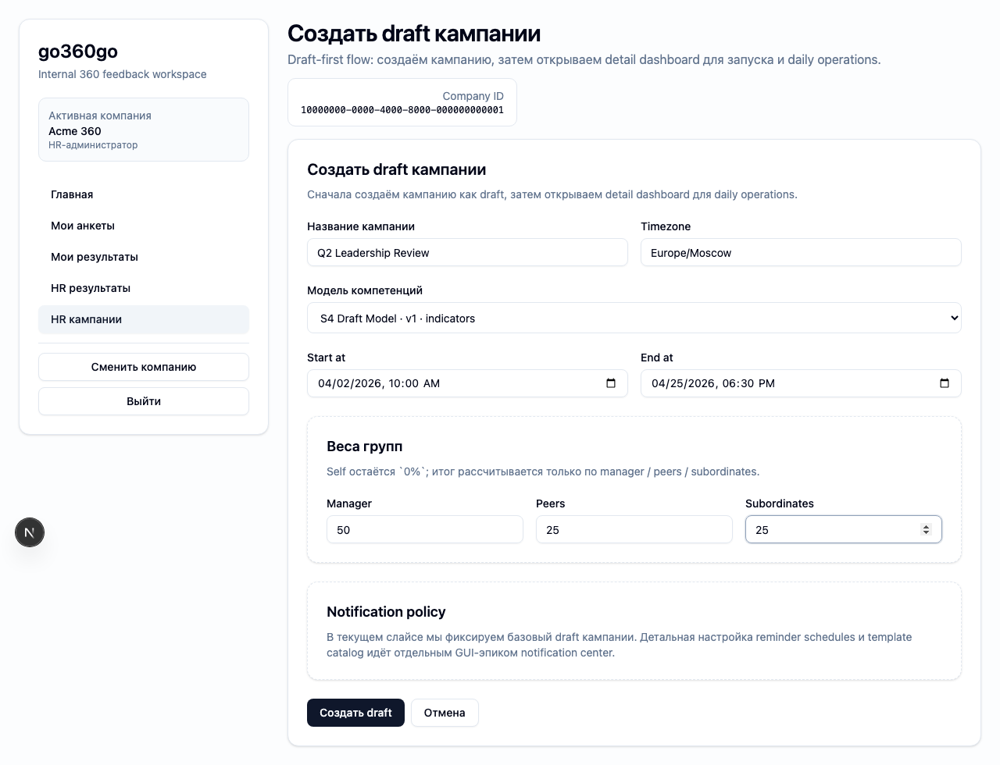
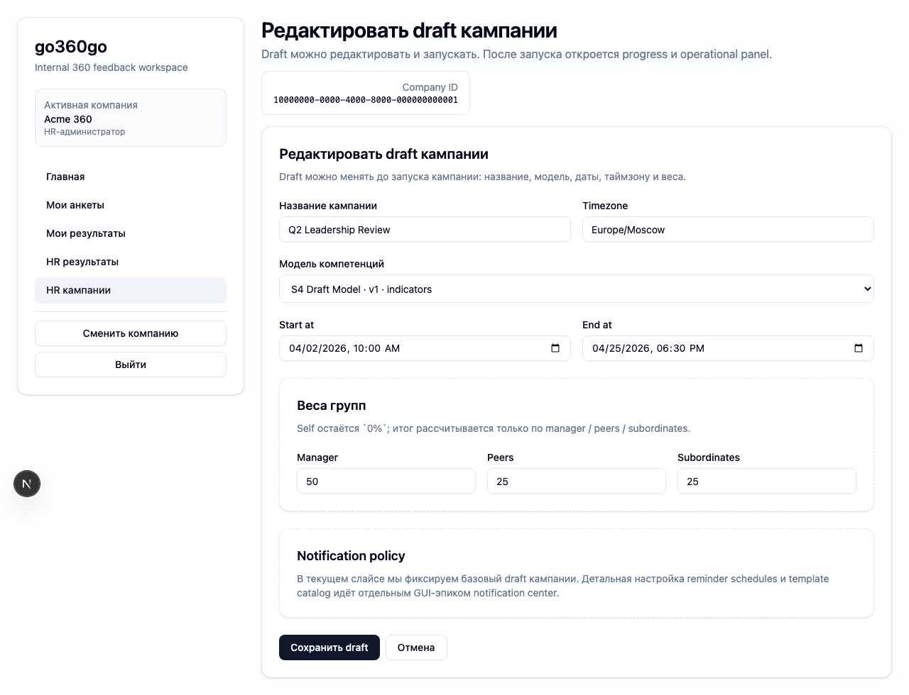

# FT-0122 — Campaign create and draft configuration
Status: Completed (2026-03-06)

## User value
HR может создать campaign draft и настроить её без CLI: выбрать модель, сроки, timezone и веса.

## Deliverables
- Create/edit draft flow.
- Multi-section form for model, dates, timezone and weights.
- Validation states and saved draft reopen flow.

## Context (SSoT links)
- [Campaign lifecycle](../../../../../spec/domain/campaign-lifecycle.md): что можно менять в `draft`. Читать, чтобы form не обещала недоступные изменения.
- [Calculations](../../../../../spec/domain/calculations.md): веса групп и их ограничения. Читать, чтобы validation была согласована с доменом.
- [Stitch mapping — EP-012](../../../../../spec/ui/design-references-stitch.md#ep-012--hr-campaigns-ux): section layout reference.

## Project grounding
- Прочитать текущие campaign settings в spec/client-api/cli.
- Свериться с reminder/timezone rules.

## Implementation plan
- Собрать draft editor поверх existing create/update ops.
- Делать optimistic UX только там, где это не нарушает authoritative backend validation.
- Сохранять progress section-by-section или whole draft.

## Scenarios (auto acceptance)
### Setup
- Seed: `S4_campaign_draft` (published model already included in canonical draft seed).

### Action
1. HR создаёт новый draft.
2. Заполняет настройки.
3. Сохраняет и повторно открывает draft.

### Assert
- Draft сохраняется.
- Validation понятна и не даёт сломанных комбинаций.
- Повторное открытие восстанавливает введённые данные.

### Client API ops (v1)
- Campaign create/update draft operations.

## Manual verification (deployed environment)
- `beta`: создать draft campaign, заполнить form, сохранить, открыть заново и сравнить состояние.

## Docs updates (SSoT)
- [UI sitemap & flows](../../../../../spec/ui/sitemap-and-flows.md)

## Progress note (2026-03-06)
- Выполнен вертикальный слайс FT-0122:
  - добавлена отдельная form-driven UX поверхность `/hr/campaigns/new` и `/hr/campaigns/[campaignId]/edit`;
  - реализован route handler `/api/hr/campaigns/draft` для create/update draft + weights save через один user-facing flow;
  - campaign detail теперь получает flash state `created/saved`, а form re-open восстанавливает значения draft из typed data.

## Quality checks evidence (2026-03-06)
- `pnpm checks` → passed.

## Acceptance evidence (2026-03-06)
- `PLAYWRIGHT_BASE_URL=http://localhost:3101 cd apps/web && node ../../node_modules/@playwright/test/cli.js test --config playwright/playwright.config.mjs tests/ft-0122-campaign-draft-config.spec.ts --workers=1 --reporter=line` → passed.
- Covered acceptance:
  - `S4_campaign_draft`: create form доступна без CLI bootstrap.
  - HR создаёт draft с кастомными timezone/dates/weights и попадает на detail page с flash confirmation.
  - Re-open `/edit` восстанавливает сохранённые значения без drift.
- Artifacts:
  - step-01: create draft form.
    
  - step-02: edit draft re-open with persisted values.
    

## Manual verification (deployed environment)
### Beta scenario — create and re-open draft
- Environment:
  - URL: `https://beta.go360go.ru`
  - account: `deksden@deksden.com`
- Steps:
  1. Войти по magic link, выбрать активную компанию и открыть `https://beta.go360go.ru/hr/campaigns/new`.
  2. Заполнить название, timezone, start/end и веса.
  3. Сохранить draft и дождаться redirect на detail page с success banner.
  4. Перейти в `Редактировать draft` и убедиться, что поля восстановлены.
- Expected:
  - draft создаётся без CLI;
  - detail page показывает success banner и campaign name;
  - reopened draft сохраняет введённые значения.
