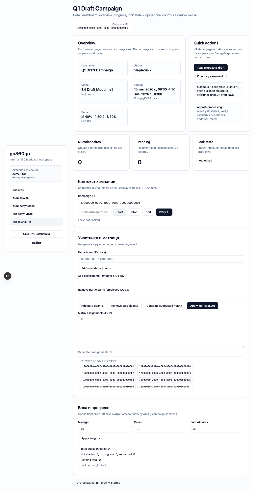
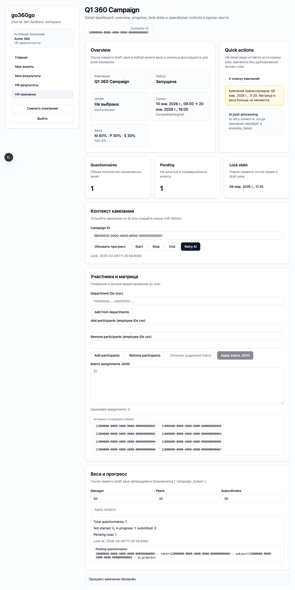
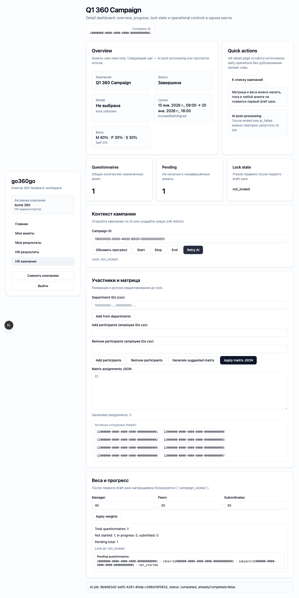

# FT-0123 — Campaign detail dashboard and daily operations
Status: Completed (2026-03-06)

## User value
HR видит progress, lock status и lifecycle actions одной кампании на одном экране.

## Deliverables
- Detail dashboard with overview/progress/actions.
- Lock banner and started/ended restrictions.
- AI retry panel and action cluster.

## Context (SSoT links)
- [Campaign lifecycle](../../../../../spec/domain/campaign-lifecycle.md): transitions и read-only behavior. Читать, чтобы кнопки точно соответствовали state machine.
- [Assignments and matrix](../../../../../spec/domain/assignments-and-matrix.md): ограничения до/после lock. Читать, чтобы detail dashboard не позволял запрещённые edits.
- [Stitch mapping — EP-012](../../../../../spec/ui/design-references-stitch.md#ep-012--hr-campaigns-ux): summary/action grouping reference.

## Project grounding
- Прочитать текущий HR workbench and FT-0084 docs.
- Проверить campaign progress and AI retry flows.

## Implementation plan
- Разбить существующий workbench на overview sections.
- Явно подсвечивать reason for disabled actions.
- Добавить summary blocks и structured action zones.

## Scenarios (auto acceptance)
### Setup
- Seed: `S4_campaign_draft`, `S5_campaign_started_no_answers`, `S8_campaign_ended`.

### Action
1. Start draft campaign.
2. Дождаться/смоделировать first draft save and lock.
3. Проверить ended/ai_failed actions.

### Assert
- Lock banner появляется вовремя.
- Недопустимые действия disabled/hidden с пояснением.
- AI retry surface показывает корректный current state.

### Client API ops (v1)
- Campaign start/stop/end/progress/AI retry ops.

## Manual verification (deployed environment)
- `beta`: пройти путь draft → started → locked → ended/ai_failed и проверить реакцию detail dashboard.

## Docs updates (SSoT)
- [UI sitemap & flows](../../../../../spec/ui/sitemap-and-flows.md)

## Progress note (2026-03-06)
- Выполнен вертикальный слайс FT-0123:
  - campaign detail page собрана как отдельный overview/progress/actions dashboard поверх существующего workbench;
  - quick actions и disabled states отражают lifecycle/freeze правила, а create section workbench скрыт на detail page;
  - detail page показывает lock banner, progress cards, AI retry surface и campaign name как primary context.

## Quality checks evidence (2026-03-06)
- `pnpm checks` → passed.

## Acceptance evidence (2026-03-06)
- `PLAYWRIGHT_BASE_URL=http://localhost:3101 cd apps/web && node ../../node_modules/@playwright/test/cli.js test --config playwright/playwright.config.mjs tests/ft-0123-campaign-detail-dashboard.spec.ts --workers=1 --reporter=line` → passed.
- Covered acceptance:
  - `S4_campaign_draft`: draft campaign starts from detail dashboard.
  - `S5_campaign_started_no_answers`: first questionnaire draft save triggers campaign lock banner and disables weights apply.
  - `S8_campaign_ended`: ended campaign exposes AI retry and returns success message from MVP stub.
- Artifacts:
  - step-01: draft campaign started from detail dashboard.
    
  - step-02: locked campaign detail.
    
  - step-03: ended campaign AI retry.
    

## Manual verification (deployed environment)
### Beta scenario — detail dashboard lifecycle
- Environment:
  - URL: `https://beta.go360go.ru`
  - account: `deksden@deksden.com`
- Steps:
  1. Войти по magic link и открыть detail page любой draft campaign.
  2. Нажать `Start` и убедиться, что status и progress blocks обновились.
  3. После первого draft save в анкете по этой кампании обновить detail page и проверить lock banner.
  4. Для ended campaign нажать `Retry AI` и проверить success message на workbench.
- Expected:
  - detail page показывает overview/progress/actions на одном экране;
  - lock banner появляется после первого draft save;
  - AI retry доступен только в корректных состояниях и показывает результат запуска.
