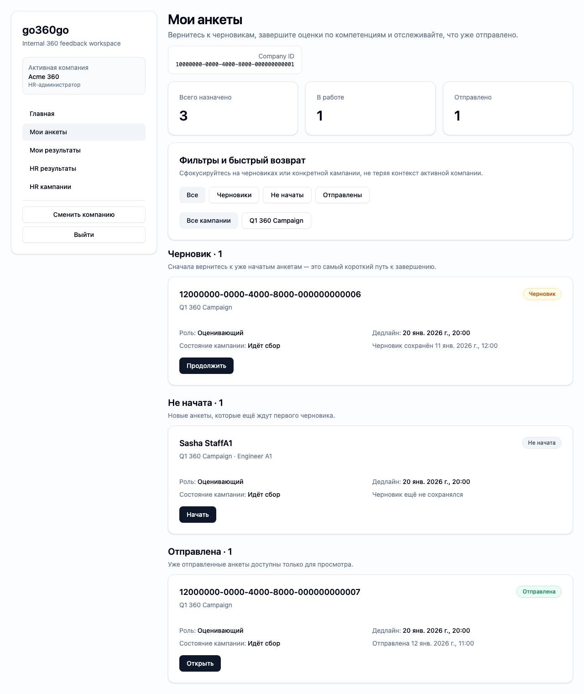
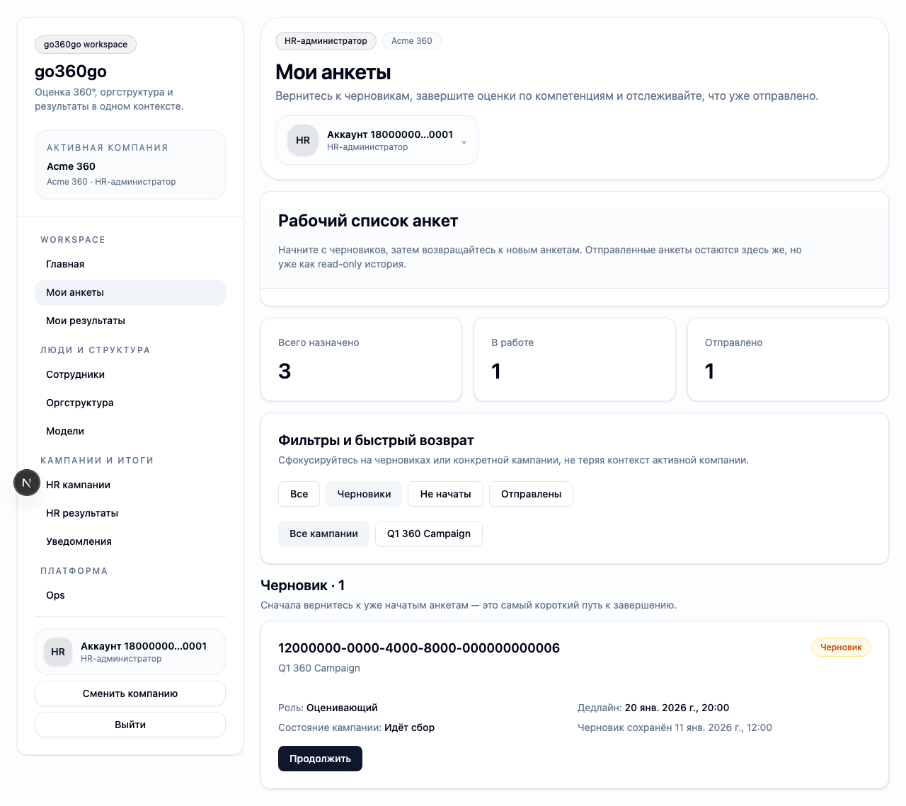
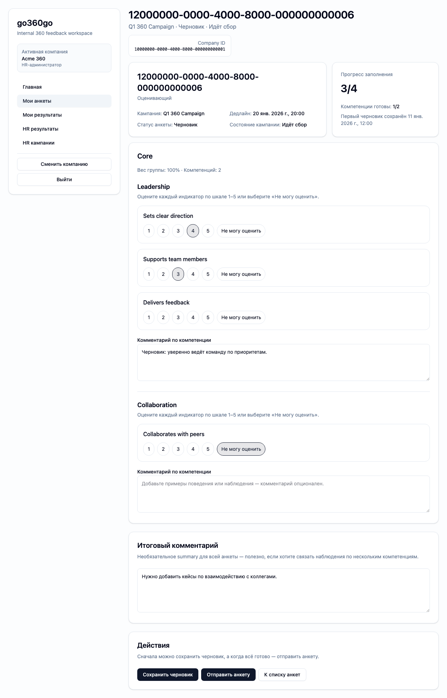

# FT-0131 — Questionnaire inbox
Status: Completed (2026-03-06)

## User value
Оценивающий быстро видит свои анкеты, понимает статусы и может вернуться к черновику без лишних переходов.

## Deliverables
- Inbox with filters by status/campaign.
- Resume draft CTA.
- Grouping and status chips.

## Context (SSoT links)
- [Questionnaires](../../../../../spec/domain/questionnaires.md): draft/submit semantics. Читать, чтобы inbox статусы были точными.
- [UI sitemap & flows](../../../../../spec/ui/sitemap-and-flows.md): место inbox в employee flow. Читать, чтобы не потерять вход в анкету.
- [Stitch mapping — EP-013](../../../../../spec/ui/design-references-stitch.md#ep-013--questionnaire-experience): reference for task list structure.

## Project grounding
- Прочитать FT-0082 и текущий questionnaire list screen.
- Проверить seeded status variants.

## Implementation plan
- Пересобрать current list into richer inbox.
- Добавить grouping/filtering and resume-draft affordance.
- Не дублировать server authority по status.

## Scenarios (auto acceptance)
### Setup
- Seed: `S5_campaign_started_no_answers`, `S6_campaign_started_some_drafts`, `S7_campaign_started_some_submitted`.

### Action
1. Открыть inbox.
2. Переключить фильтры.
3. Resume draft.

### Assert
- Статусы совпадают с seed.
- Resume draft ведёт в правильную анкету.
- Submitted items clearly distinguished.

### Client API ops (v1)
- `questionnaire.listAssigned`, `questionnaire.getDraft`.

## Manual verification (deployed environment)
- `beta`: открыть `My questionnaires`, отфильтровать `in progress`, зайти обратно в draft.

## Docs updates (SSoT)
- [UI sitemap & flows](../../../../../spec/ui/sitemap-and-flows.md)

## Progress note (2026-03-06)
- Выполнен вертикальный слайс FT-0131:
  - `questionnaire.listAssigned` возвращает campaign/subject/rater metadata, draft timestamps и status context;
  - `/questionnaires` стал inbox с counters, status/campaign filters и resume/open CTA;
  - acceptance seed `S7_campaign_started_some_submitted` теперь стабильно покрывает not_started/in_progress/submitted набор в одном сценарии.

## Quality checks evidence (2026-03-06)
- `pnpm --filter @feedback-360/api-contract test` → passed.
- `pnpm --filter @feedback-360/db test -- --runInBand` → passed.
- `pnpm --filter @feedback-360/web lint` → passed.
- `pnpm --filter @feedback-360/web typecheck` → passed.
- `pnpm --filter @feedback-360/web test` → passed.
- `pnpm --filter @feedback-360/web build` → passed.

## Acceptance evidence (2026-03-06)
- `PLAYWRIGHT_BASE_URL=http://localhost:3111 cd apps/web && node ../../node_modules/@playwright/test/cli.js test --config playwright/playwright.config.mjs tests/ft-0131-questionnaire-inbox.spec.ts --workers=1 --reporter=line` → passed.
- Covered acceptance:
  - `S7_campaign_started_some_submitted`: inbox показывает counters по всем status и группирует карточки по секциям.
  - Status filter `in_progress` оставляет только draft questionnaire.
  - Resume/open CTA возвращает пользователя в нужную анкету с сохранённым company context.
- Artifacts:
  - step-01: inbox со всеми статусами.
    
  - step-02: фильтр drafts.
    
  - step-03: возврат в draft questionnaire.
    

## Manual verification (deployed environment)
### Beta scenario — questionnaire inbox
- Environment:
  - URL: `https://beta.go360go.ru`
  - account: `deksden@deksden.com`
- Steps:
  1. Войти по magic link и выбрать активную компанию.
  2. Открыть `https://beta.go360go.ru/questionnaires`.
  3. Проверить counters `Всего назначено`, `В работе`, `Отправлено`.
  4. Включить фильтр `Черновики` и убедиться, что в списке остались только анкеты `Черновик`.
  5. Открыть draft через CTA `Продолжить`.
- Expected:
  - counters совпадают с текущим состоянием beta seed/компании;
  - фильтр меняет URL query и скрывает not_started/submitted rows;
  - CTA открывает нужную анкету без потери company context.
