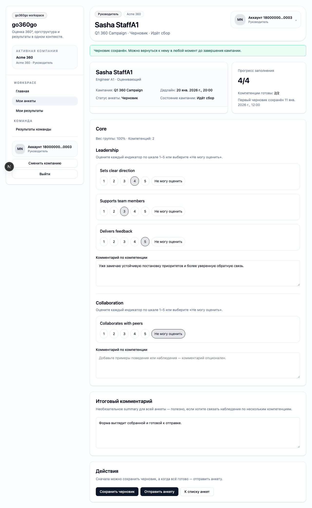
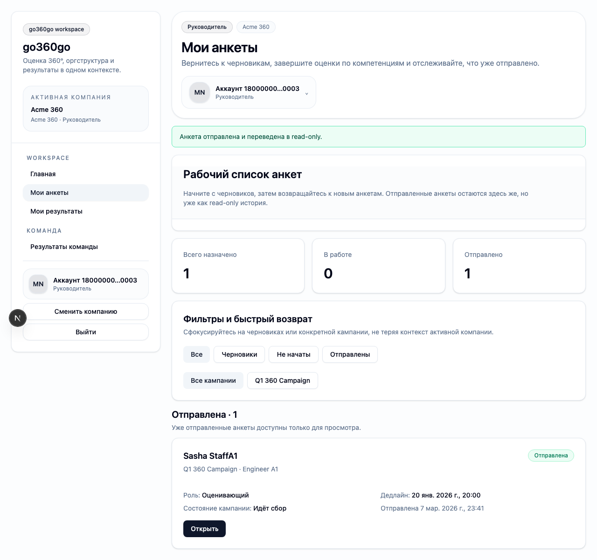

# FT-0132 — Structured questionnaire fill flow
Status: Completed (2026-03-06)

## User value
Пользователь спокойно проходит форму оценки по компетенциям и получает понятную обратную связь при save/submit.

## Deliverables
- Structured multi-section form.
- Progress header.
- Save draft feedback and submit confirmation.

## Context (SSoT links)
- [Questionnaires](../../../../../spec/domain/questionnaires.md): per-competency comments, optional final comment, submit rules. Читать, чтобы form точно отражала домен.
- [Testing standards](../../../../../spec/engineering/testing-standards.md): для этой фичи нужны e2e и regression tests. Читать, чтобы сразу спроектировать проверяемый flow.
- [Stitch mapping — EP-013](../../../../../spec/ui/design-references-stitch.md#ep-013--questionnaire-experience): основной visual reference формы.

## Project grounding
- Проверить текущую форму и действующие route handlers.
- Свериться с constraints по optional comments и read-only transitions.

## Implementation plan
- Разбить вопросы на понятные секции.
- Показать progress and save state.
- Сохранять thin UI contract with server responses.

## Scenarios (auto acceptance)
### Setup
- Seed: `S5_campaign_started_no_answers`, `S6_campaign_started_some_drafts`.

### Action
1. Заполнить часть компетенций.
2. Save draft.
3. Reload.
4. Submit.

### Assert
- Draft восстанавливается.
- Submit финализирует questionnaire.
- User sees success and next step.

### Client API ops (v1)
- `questionnaire.getDraft`, `questionnaire.saveDraft`, `questionnaire.submit`.

## Manual verification (deployed environment)
- `beta`: открыть анкету, сохранить draft, обновить страницу, дозаполнить и отправить.

## Docs updates (SSoT)
- [UI sitemap & flows](../../../../../spec/ui/sitemap-and-flows.md)

## Progress note (2026-03-06)
- Выполнен вертикальный слайс FT-0132:
  - `questionnaire.getDraft` возвращает resolved questionnaire definition из `campaign.model_version_id`;
  - questionnaire page рендерит indicators/levels, per-competency comments, final comment и progress card;
  - draft/save/submit route handlers принимают structured form payload, не перенося доменные правила в UI.

## Quality checks evidence (2026-03-06)
- `pnpm --filter @feedback-360/api-contract test` → passed.
- `pnpm --filter @feedback-360/db test -- --runInBand` → passed.
- `pnpm --filter @feedback-360/cli typecheck` → passed.
- `pnpm --filter @feedback-360/cli test` → passed.
- `pnpm --filter @feedback-360/web lint` → passed.
- `pnpm --filter @feedback-360/web typecheck` → passed.
- `pnpm --filter @feedback-360/web test` → passed.
- `pnpm --filter @feedback-360/web build` → passed.

## Acceptance evidence (2026-03-06)
- `PLAYWRIGHT_BASE_URL=http://localhost:3111 cd apps/web && node ../../node_modules/@playwright/test/cli.js test --config playwright/playwright.config.mjs tests/ft-0132-questionnaire-fill-flow.spec.ts --workers=1 --reporter=line` → passed.
- Covered acceptance:
  - `S6_campaign_started_some_drafts`: existing draft восстанавливается в structured form.
  - Дополнение последнего индикатора и комментариев обновляет progress до `4/4`.
  - Submit переводит анкету в `submitted` и возвращает пользователя в inbox с success banner.
- Artifacts:
  - step-01: draft восстановлен и досохранён.
    
  - step-02: questionnaire submitted.
    

## Manual verification (deployed environment)
### Beta scenario — fill, save and submit
- Environment:
  - URL: `https://beta.go360go.ru`
  - account: `deksden@deksden.com`
- Steps:
  1. Открыть любую анкету в статусе `Черновик` или `Не начата`.
  2. Заполнить несколько индикаторов/уровней и хотя бы один комментарий по компетенции.
  3. Нажать `Сохранить черновик` и дождаться success banner.
  4. Обновить страницу и убедиться, что выбранные значения и комментарии восстановились.
  5. Нажать `Отправить анкету`.
- Expected:
  - progress card обновляется по мере заполнения;
  - после save draft значения и комментарии не теряются;
  - после submit пользователь возвращается в inbox, а анкета показывается как `Отправлена`.
