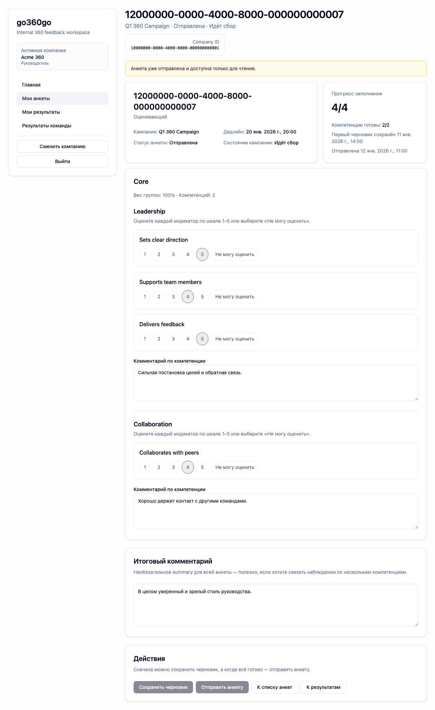
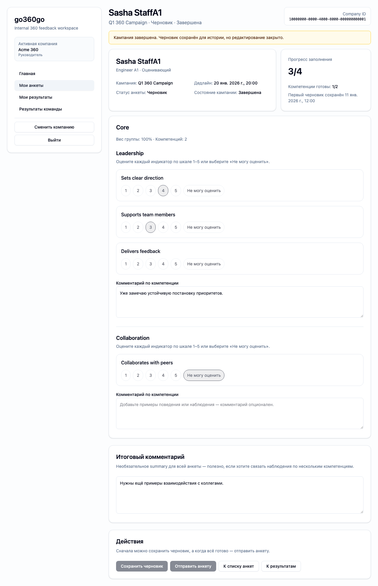

# FT-0133 — Read-only and re-entry states
Status: Completed (2026-03-06)

## User value
После submit или ended campaign пользователь не сомневается, можно ли ещё что-то менять, и понимает, куда идти дальше.

## Deliverables
- Read-only questionnaire view.
- Submitted/ended banners and disabled controls.
- Back-to-inbox/results actions.

## Context (SSoT links)
- [Campaign lifecycle](../../../../../spec/domain/campaign-lifecycle.md): `ended` read-only semantics. Читать, чтобы banners and disabled controls были точными.
- [Questionnaires](../../../../../spec/domain/questionnaires.md): immutable after submit behavior. Читать, чтобы UI правильно различал submitted vs ended.
- [Stitch mapping — EP-013](../../../../../spec/ui/design-references-stitch.md#ep-013--questionnaire-experience): layout source, к которому добавляем explicit read-only affordances.

## Project grounding
- Прочитать FT-0045 и FT-0082 evidence.
- Проверить все server error codes around readonly/ended.

## Implementation plan
- Вынести read-only presentation state.
- Добавить clear reason messages and return paths.
- Обработать direct-link reopen cases.

## Scenarios (auto acceptance)
### Setup
- Seed: `S7_campaign_started_some_submitted`, `S8_campaign_ended`.

### Action
1. Открыть submitted questionnaire.
2. Открыть ended questionnaire.
3. Попробовать изменить answer.

### Assert
- Inputs read-only.
- Friendly banner shown.
- Backend readonly errors correctly surfaced.

### Client API ops (v1)
- Questionnaire loaders + readonly error handling.

## Manual verification (deployed environment)
- `beta`: открыть уже submitted and ended questionnaires; убедиться, что edit path закрыт.

## Docs updates (SSoT)
- [UI sitemap & flows](../../../../../spec/ui/sitemap-and-flows.md)

## Progress note (2026-03-06)
- Выполнен вертикальный слайс FT-0133:
  - questionnaire detail page показывает explicit read-only banner для `submitted` и `ended|processing_ai|ai_failed|completed`;
  - action buttons disabled, но пользователь получает clear exit path обратно в inbox/results;
  - backend write paths остаются source of truth и возвращают `campaign_ended_readonly`, который UI дружелюбно отражает.

## Quality checks evidence (2026-03-06)
- `pnpm --filter @feedback-360/db test -- --runInBand` → passed.
- `pnpm --filter @feedback-360/web lint` → passed.
- `pnpm --filter @feedback-360/web typecheck` → passed.
- `pnpm --filter @feedback-360/web test` → passed.
- `pnpm --filter @feedback-360/web build` → passed.

## Acceptance evidence (2026-03-06)
- `PLAYWRIGHT_BASE_URL=http://localhost:3111 cd apps/web && node ../../node_modules/@playwright/test/cli.js test --config playwright/playwright.config.mjs tests/ft-0133-questionnaire-readonly.spec.ts --workers=1 --reporter=line` → passed.
- Covered acceptance:
  - `S7_campaign_started_some_submitted`: submitted questionnaire reopens в read-only режиме с disabled actions и CTA к результатам.
  - `S8_campaign_ended`: ended questionnaire остаётся read-only и backend `POST /api/questionnaires/draft` возвращает `409 campaign_ended_readonly`.
- Artifacts:
  - step-01: submitted questionnaire read-only.
    
  - step-02: ended questionnaire read-only.
    

## Manual verification (deployed environment)
### Beta scenario — read-only and re-entry
- Environment:
  - URL: `https://beta.go360go.ru`
  - account: `deksden@deksden.com`
- Steps:
  1. Открыть уже отправленную анкету через inbox.
  2. Проверить warning banner и disabled состояния `Сохранить черновик` / `Отправить анкету`.
  3. Если есть завершённая кампания, открыть её анкету direct link из inbox или browser history.
  4. Убедиться, что экран остаётся read-only и не скрывает причину блокировки.
- Expected:
  - submitted questionnaire показывает причину immutable state и CTA к результатам;
  - ended questionnaire показывает, что кампания завершена;
  - попытки изменить ответы через UI недоступны, а backend пишет `409` при прямом POST.
