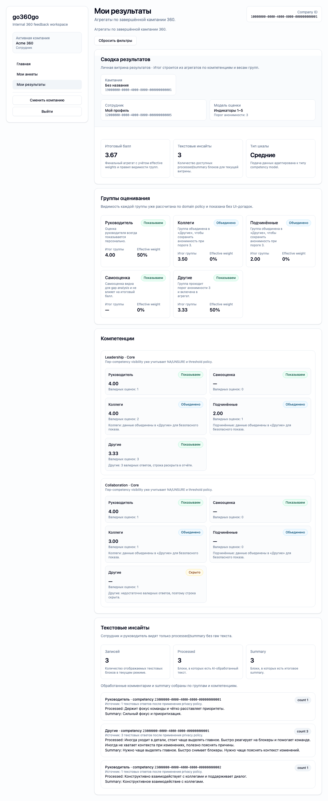

# FT-0151 — Employee results dashboard
Status: Completed (2026-03-06)

## User value
Сотрудник понимает свои результаты 360 в одном экране без доступа к raw comments.

## Deliverables
- Summary cards, group breakdown, competency sections.
- Processed comments and summary blocks.
- Empty state when results are not ready.

## Context (SSoT links)
- [Results visibility](../../../../../spec/domain/results-visibility.md): что employee может видеть. Читать, чтобы не показать raw/private data.
- [Anonymity policy](../../../../../spec/domain/anonymity-policy.md): hidden/merged groups behavior. Читать, чтобы summary правильно объяснял отсутствующие блоки.
- [Stitch mapping — EP-015](../../../../../spec/ui/design-references-stitch.md#ep-015--results-experience): employee report visual hierarchy.

## Project grounding
- Прочитать FT-0083 and FT-0101 docs.
- Проверить completed result seeds and processed-text availability.

## Implementation plan
- Пересобрать current results page into structured dashboard.
- Добавить results-ready/empty state.
- Отделить summary, group breakdown and text insights.

## Scenarios (auto acceptance)
### Setup
- Seed: `S9_campaign_completed_with_ai`.

### Action
1. Employee opens `My results`.
2. Switches completed campaigns or sections.

### Assert
- No raw text.
- Processed summary visible.
- Hidden groups explained.

### Client API ops (v1)
- `results.getMyDashboard`.

## Manual verification (deployed environment)
- `beta`: войти как employee with completed campaign and review full dashboard.

## Docs updates (SSoT)
- [UI sitemap & flows](../../../../../spec/ui/sitemap-and-flows.md)

## Progress note (2026-03-06)
- Выполнен вертикальный слайс FT-0151:
  - `/results` пересобрана в dashboard с summary card, KPI tiles, group breakdown и competency insights;
  - employee видит только processed/summary text, а raw comments остаются недоступными;
  - legacy privacy acceptance FT-0083 сохранён и теперь проходит поверх нового UI.

## Quality checks evidence (2026-03-06)
- `pnpm --filter @feedback-360/web lint` → passed.
- `pnpm --filter @feedback-360/web typecheck` → passed.
- `pnpm --filter @feedback-360/web test` → passed.
- `pnpm --filter @feedback-360/web build` → passed.

## Acceptance evidence (2026-03-06)
- Local acceptance:
  - `cd apps/web && PLAYWRIGHT_BASE_URL=http://127.0.0.1:3101 node ../../node_modules/@playwright/test/cli.js test --config playwright/playwright.config.mjs tests/ft-0083-results-ui.spec.ts tests/ft-0151-employee-results-dashboard.spec.ts --workers=1 --reporter=line` → passed.
- Beta acceptance:
  - `cd apps/web && PLAYWRIGHT_BASE_URL=https://beta.go360go.ru node ../../node_modules/@playwright/test/cli.js test --config playwright/playwright.config.mjs tests/ft-0083-results-ui.spec.ts tests/ft-0151-employee-results-dashboard.spec.ts --workers=1 --reporter=line` → passed after merge commit `82eb507975ceda162f29e53c42cfd0ba8fb2bcaf`.
- Covered acceptance:
  - employee открывает completed campaign и получает structured dashboard;
  - processed text виден, raw text отсутствует;
  - group cards и competency sections объясняют visibility state без раскрытия лишних данных.
- Artifacts:
  - employee results dashboard.
    

## Manual verification (deployed environment)
### Beta scenario — employee results dashboard
- Environment:
  - URL: `https://beta.go360go.ru`
  - account: employee with completed campaign (`deksden@deksden.com` через CLI-prepared seed)
- Steps:
  1. Войти по magic link и выбрать активную компанию.
  2. Открыть `/results?campaignId=<completed_campaign_id>`.
  3. Проверить summary card, group cards и competency blocks.
  4. Убедиться, что в open-text секции нет `Raw:`.
- Expected:
  - summary/KPI cards видимы;
  - processed/summary text есть там, где данные готовы;
  - raw comments не раскрываются.
- Result:
  - passed on `https://beta.go360go.ru`.
