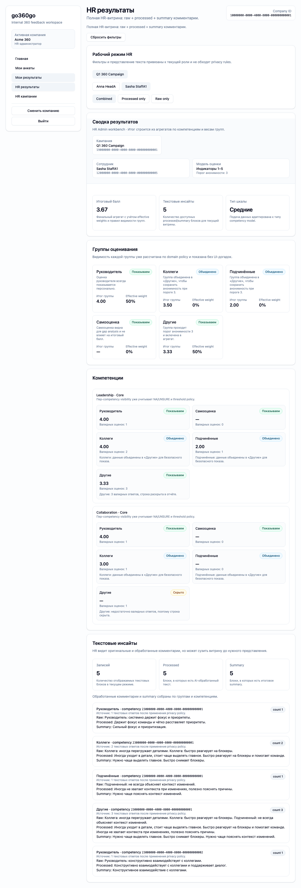
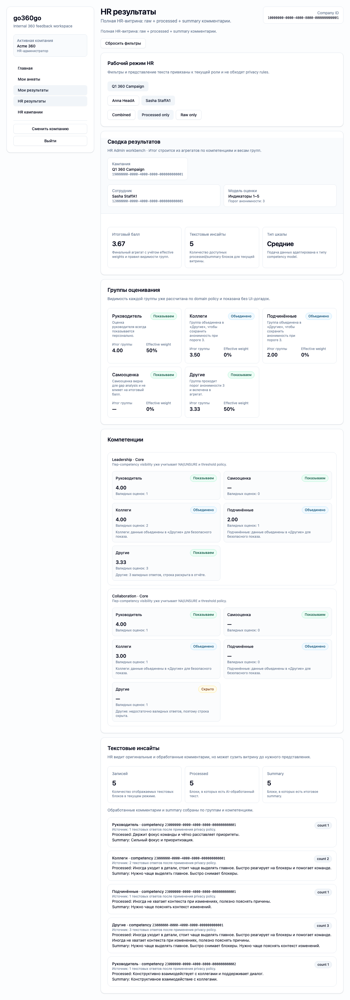
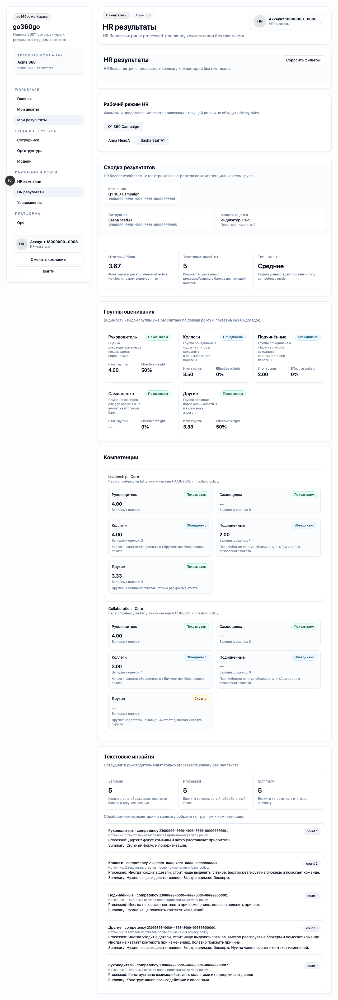

# FT-0153 — HR results workbench
Status: Completed (2026-03-06)

## User value
HR видит полный разбор результатов и комментариев сотрудника в одном рабочем интерфейсе.

## Deliverables
- Subject filters and drill-down.
- Raw/processed toggle for `hr_admin`.
- Diagnostics markers for AI/text shaping.

## Context (SSoT links)
- [Results visibility](../../../../../spec/domain/results-visibility.md): различия `hr_admin` vs `hr_reader`. Читать, чтобы toggle and drill-down obeyed permissions.
- [AI processing](../../../../../spec/ai/ai-processing.md): processed comment lifecycle. Читать, чтобы HR UI правильно маркировал AI-derived content.
- [Stitch mapping — EP-015](../../../../../spec/ui/design-references-stitch.md#ep-015--results-experience): report composition reference for HR extension.

## Project grounding
- Прочитать FT-0055, FT-0073, FT-0101.
- Проверить current `/results/hr`.

## Implementation plan
- Разделить HR readers/admin views cleanly.
- Добавить richer filters and diagnostics.
- Preserve existing visibility rules in UI.

## Scenarios (auto acceptance)
### Setup
- Seed: `S9_campaign_completed_with_ai`.

### Action
1. Open HR results as `hr_admin`.
2. Repeat as `hr_reader`.

### Assert
- `hr_admin` sees raw + processed + summary.
- `hr_reader` sees no raw.
- Filters/drill-down preserve access model.

### Client API ops (v1)
- `results.getHrView`.

## Manual verification (deployed environment)
- `beta`: compare `hr_admin` and `hr_reader` on the same completed campaign.

## Docs updates (SSoT)
- [UI sitemap & flows](../../../../../spec/ui/sitemap-and-flows.md)

## Progress note (2026-03-06)
- Выполнен вертикальный слайс FT-0153:
  - `/results/hr` получил HR toolbar с campaign/subject filters и snapshot-aware subject list;
  - `hr_admin` получил text-mode controls (`combined / processed / raw`) без изменения underlying permissions;
  - `hr_reader` остаётся redacted и не получает controls для raw текста.

## Quality checks evidence (2026-03-06)
- `pnpm --filter @feedback-360/web lint` → passed.
- `pnpm --filter @feedback-360/web typecheck` → passed.
- `pnpm --filter @feedback-360/web test` → passed.
- `pnpm --filter @feedback-360/web build` → passed.

## Acceptance evidence (2026-03-06)
- Local acceptance:
  - `cd apps/web && PLAYWRIGHT_BASE_URL=http://127.0.0.1:3101 node ../../node_modules/@playwright/test/cli.js test --config playwright/playwright.config.mjs tests/ft-0101-results-privacy.spec.ts tests/ft-0153-hr-results-workbench.spec.ts --workers=1 --reporter=line` → passed.
- Beta acceptance:
  - `cd apps/web && PLAYWRIGHT_BASE_URL=https://beta.go360go.ru node ../../node_modules/@playwright/test/cli.js test --config playwright/playwright.config.mjs tests/ft-0101-results-privacy.spec.ts tests/ft-0153-hr-results-workbench.spec.ts --workers=1 --reporter=line` → passed after merge commit `82eb507975ceda162f29e53c42cfd0ba8fb2bcaf`.
- Covered acceptance:
  - `hr_admin` видит raw + processed в combined mode;
  - `hr_admin` может переключиться в `Processed only`, и raw исчезает из DOM;
  - `hr_reader` видит тот же workbench без raw и без text-mode controls.
- Artifacts:
  - hr admin combined view.
    
  - hr admin processed-only view.
    
  - hr reader redacted view.
    

## Manual verification (deployed environment)
### Beta scenario — HR results workbench
- Environment:
  - URL: `https://beta.go360go.ru`
  - accounts: `hr_admin` and `hr_reader` with completed campaign (`deksden@deksden.com` через CLI-prepared seed)
- Steps:
  1. Войти как `hr_admin`, открыть `/results/hr?campaignId=<completed_campaign_id>&subjectEmployeeId=<subject_id>`.
  2. Проверить toolbar, filters и text-mode controls.
  3. Переключить `Processed only` и убедиться, что `Raw:` исчезает.
  4. Повторить как `hr_reader` на тех же параметрах.
- Expected:
  - `hr_admin` видит raw/processed/summary и text-mode controls;
  - `hr_reader` не видит raw и не получает toggle controls;
  - filters и subject switching не ломают access model.
- Result:
  - passed on `https://beta.go360go.ru`.
