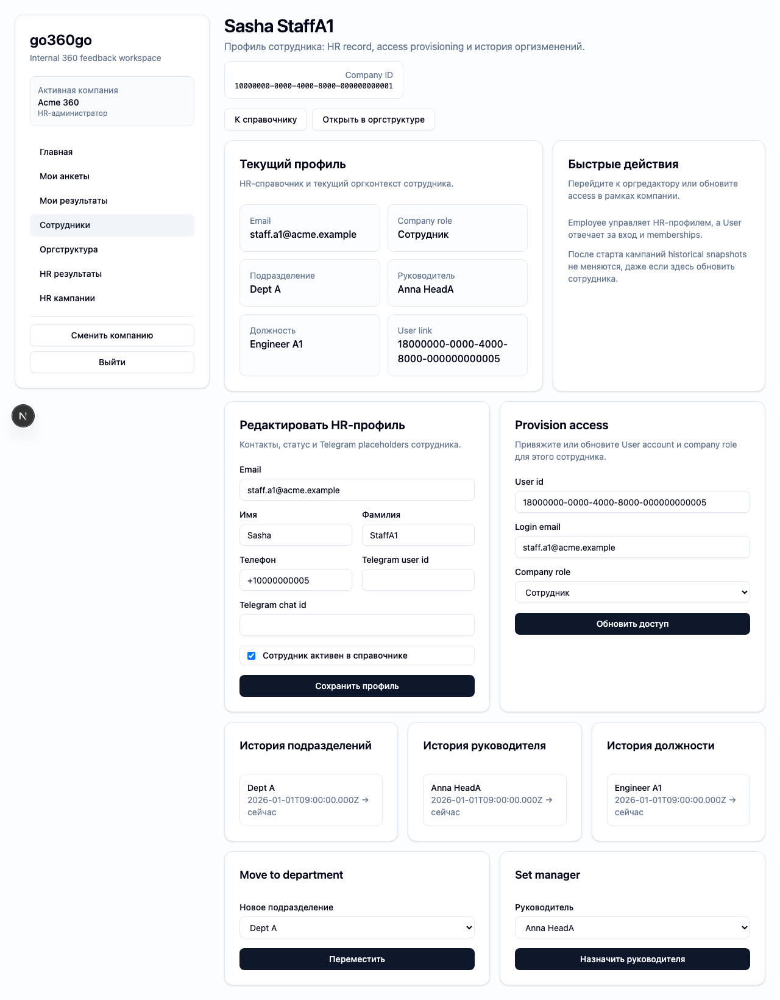

# FT-0161 — Employee directory
Status: Completed (2026-03-06)

## User value
HR быстро находит сотрудника по имени, email, отделу и статусу.

## Deliverables
- Employee directory table.
- Search and filters.
- Status markers for active/inactive/soft-deleted records.

## Context (SSoT links)
- [Auth and identity](../../../../../spec/security/auth-and-identity.md): user vs employee model. Читать, чтобы directory не смешивал сущности.
- [Soft delete and history](../../../../../spec/domain/soft-delete-and-history.md): как отображать inactive/deleted data. Читать, чтобы records не “исчезали”.
- [Stitch mapping — EP-016](../../../../../spec/ui/design-references-stitch.md#ep-016--people-and-org-admin): employee directory reference.

## Project grounding
- Проверить current employee data model and seeds.
- Свериться with HR role permissions and planned routes.

## Implementation plan
- Собрать list page with search/filter.
- Добавить status chips and deep link to profile.
- Preserve company scoping and pagination strategy.

## Scenarios (auto acceptance)
### Setup
- Seed: `S2_org_basic` plus inactive/deleted variants.

### Action
1. Open employee directory.
2. Search by email/name.
3. Filter by department/status.

### Assert
- Correct list subset returned.
- Status markers visible.
- Profile link opens targeted employee.

### Client API ops (v1)
- `employee.directoryList`
- `employee.profileGet`

## Manual verification (deployed environment)
- `beta`: search/filter employee records and open profile from list.

## Docs updates (SSoT)
- [UI sitemap & flows](../../../../../spec/ui/sitemap-and-flows.md)
- [Client API operation catalog](../../../../../spec/client-api/operation-catalog.md)

## Progress note (2026-03-06)
- Выполнен вертикальный слайс FT-0161:
  - `/hr/employees` даёт HR-directory c search, department/status filters и summary badges;
  - list строго scoped to active company membership и не смешивает `employee` с `user`;
  - из каталога можно перейти в профиль сотрудника и дальше в org flows.

## Quality checks evidence (2026-03-06)
- `pnpm lint` → passed.
- `pnpm typecheck` → passed.
- `pnpm --filter @feedback-360/web test` → passed.
- `pnpm --filter @feedback-360/web build` → passed.

## Acceptance evidence (2026-03-06)
- Local acceptance:
  - `cd apps/web && PLAYWRIGHT_BASE_URL=http://localhost:3105 node ../../node_modules/@playwright/test/cli.js test --config playwright/playwright.config.mjs tests/ft-0161-employee-directory.spec.ts --workers=1 --reporter=line` → passed.
- Covered acceptance:
  - HR открывает directory и видит текущий состав компании;
  - search и filters сокращают список без потери company scoping;
  - из списка открывается корректный employee profile.
- Artifacts:
  - employee directory and profile handoff.
    

## Manual verification (deployed environment)
### Beta scenario — employee directory
- Environment:
  - URL: `https://beta.go360go.ru`
  - account: `hr_admin` with seeded company access
- Steps:
  1. Войти по magic link и выбрать активную компанию.
  2. Открыть `/hr/employees`.
  3. Ввести часть email/name в search.
  4. Применить department/status filter и открыть карточку сотрудника.
- Expected:
  - список сокращается корректно;
  - badges показывают status;
  - profile route открывается для нужного employee.
- Result:
  - pending until merge to `develop` and beta deployment.
