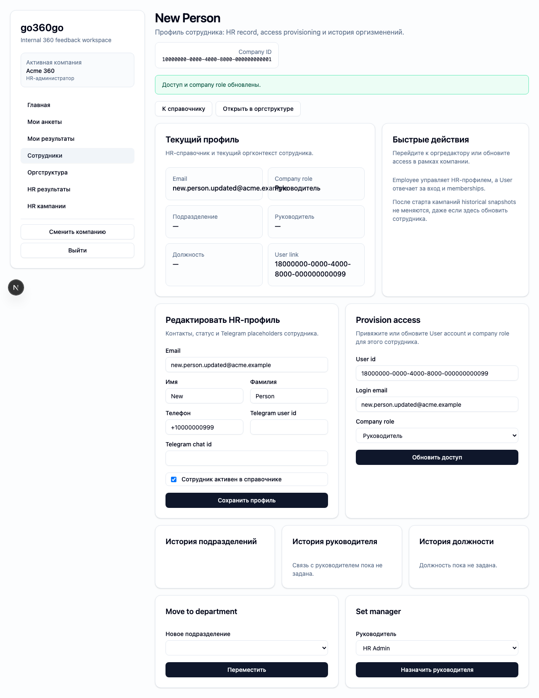
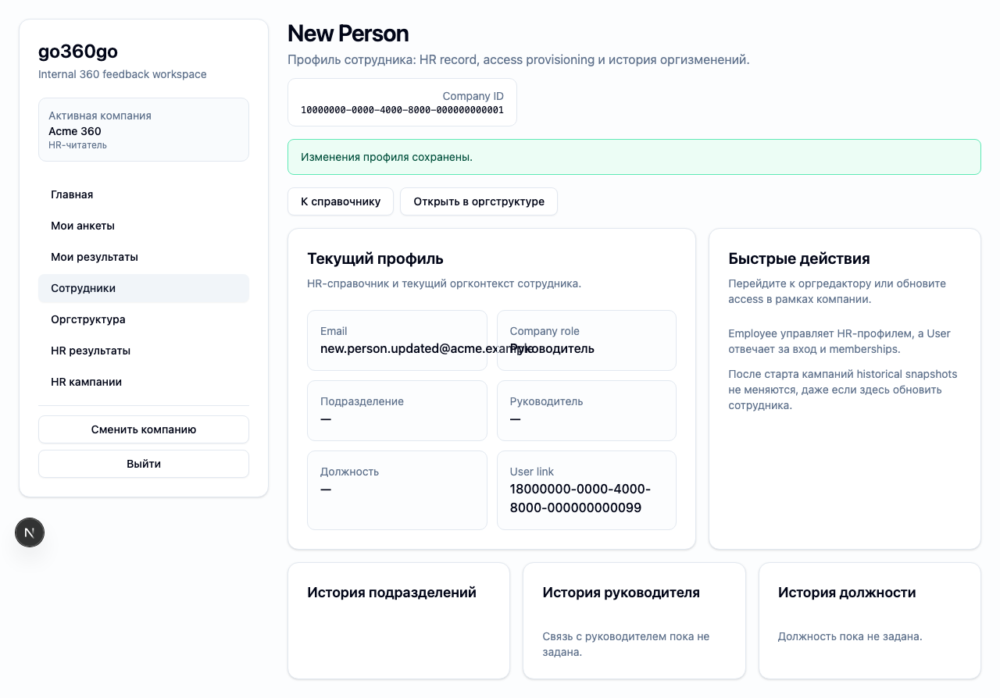

# FT-0162 — Employee profile and account provisioning
Status: Completed (2026-03-06)

## User value
HR может создать сотрудника, связанный user account и обновлять email/роль в рамках компании без обходных операций.

## Deliverables
- Employee profile page.
- Create/edit flow for employee + user linkage.
- Company role editor and contact fields.

## Context (SSoT links)
- [Auth and identity](../../../../../spec/security/auth-and-identity.md): заранее созданные accounts, email as identity, user multi-company membership. Читать, чтобы provisioning flow был верным.
- [RBAC](../../../../../spec/security/rbac.md): кто может редактировать сотрудника и роли. Читать, чтобы UI actions соответствовали permissions.
- [Stitch mapping — EP-016](../../../../../spec/ui/design-references-stitch.md#ep-016--people-and-org-admin): detail/profile visual direction.

## Project grounding
- Проверить account creation/update rules and relevant CLI/client ops.
- Свериться with email update behavior and uniqueness constraints.

## Implementation plan
- Сделать profile editor with create and update modes.
- Показать separation user vs employee, but keep workflow simple for HR.
- Add role and contact sections.

## Scenarios (auto acceptance)
### Setup
- Seed: `S1_company_min`, `S1_company_roles_min`.

### Action
1. Create employee + user.
2. Update email.
3. Change company role.

### Assert
- Pair `user/employee` remains unique within company.
- Updated email persists.
- Forbidden actions blocked for non-admin readers.

### Client API ops (v1)
- `employee.upsert`
- `employee.profileGet`
- `identity.provisionAccess`

## Manual verification (deployed environment)
- `beta`: создать тестового сотрудника, изменить email и проверить дальнейший login flow.

## Docs updates (SSoT)
- [UI sitemap & flows](../../../../../spec/ui/sitemap-and-flows.md)
- [Client API operation catalog](../../../../../spec/client-api/operation-catalog.md)

## Progress note (2026-03-06)
- Выполнен вертикальный слайс FT-0162:
  - `/hr/employees/new` и `/hr/employees/[employeeId]` покрывают create/edit flow сотрудника;
  - provisioning action создаёт или обновляет `user` access по email и роли компании без утечки лишней логики в UI;
  - `hr_reader` остаётся read-only и не получает provisioning controls.

## Quality checks evidence (2026-03-06)
- `pnpm lint` → passed.
- `pnpm typecheck` → passed.
- `pnpm --filter @feedback-360/web test` → passed.
- `pnpm --filter @feedback-360/web build` → passed.

## Acceptance evidence (2026-03-06)
- Local acceptance:
  - `cd apps/web && PLAYWRIGHT_BASE_URL=http://localhost:3105 node ../../node_modules/@playwright/test/cli.js test --config playwright/playwright.config.mjs tests/ft-0162-employee-profile-provisioning.spec.ts --workers=1 --reporter=line` → passed.
- Beta acceptance:
  - `cd apps/web && PLAYWRIGHT_BASE_URL=https://beta.go360go.ru node ../../node_modules/@playwright/test/cli.js test --config playwright/playwright.config.mjs tests/ft-0162-employee-profile-provisioning.spec.ts --workers=1 --reporter=line` → passed after merge commit `4abc86937064cf3086fab1c6ecfc2f8c7b390263`.
- Covered acceptance:
  - HR может создать сотрудника и сразу завести company access;
  - обновление email и company role сохраняется в профиле;
  - `hr_reader` видит профиль без управляющих form actions.
- Artifacts:
  - admin create and provision flow.
    
  - hr reader read-only view.
    

## Manual verification (deployed environment)
### Beta scenario — employee profile and provisioning
- Environment:
  - URL: `https://beta.go360go.ru`
  - account: `hr_admin` with seeded company access
- Steps:
  1. Войти и открыть `/hr/employees/new`.
  2. Создать test employee с email и базовыми контактами.
  3. Открыть созданный профиль и выполнить provisioning access.
  4. Изменить email или роль компании и сохранить.
- Expected:
  - employee profile создаётся;
  - provisioning action возвращает связанный account status;
  - изменения email/role сохраняются и видны после reload.
- Result:
  - passed on `https://beta.go360go.ru`.
