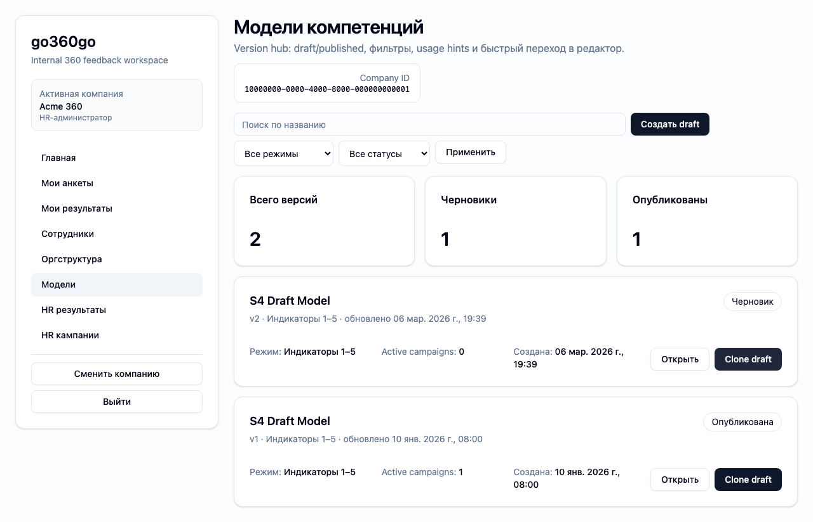

# FT-0171 — Model catalog and version hub
Status: Completed (2026-03-06)

## User value
HR видит все competency models и версии в одном месте и понимает, какие из них можно использовать.

## Deliverables
- Models list.
- Version badges/statuses.
- Clone/create draft action.

## Context (SSoT links)
- [Competency models](../../../../../spec/domain/competency-models.md): versioned model structure and kinds. Читать, чтобы catalog показывал реальные сущности.
- [Campaign lifecycle](../../../../../spec/domain/campaign-lifecycle.md): active campaign linkage matters for model usage hints. Читать, чтобы предупреждать про used versions.
- [Stitch mapping — EP-017](../../../../../spec/ui/design-references-stitch.md#ep-017--competency-models-and-matrix-ui): `_4` editor/catalog reference.

## Project grounding
- Проверить existing model versions and seed states.
- Свериться with current create/clone flows in CLI/core.

## Implementation plan
- Сделать catalog page with filter and status info.
- Add clone/create draft actions.
- Surface “used by active campaign” hints.

## Scenarios (auto acceptance)
### Setup
- Seed: `S3_model_indicators`, `S3_model_levels`.

### Action
1. Open models list.
2. Filter by kind/status.
3. Clone draft from existing version.

### Assert
- Active and draft versions differentiated.
- Clone creates new draft without mutating source version.

### Client API ops (v1)
- Model list/clone draft ops.

## Manual verification (deployed environment)
- `beta`: review models list, clone a draft, verify it appears as new version.

## Docs updates (SSoT)
- [UI sitemap & flows](../../../../../spec/ui/sitemap-and-flows.md)
- [Client API operation catalog](../../../../../spec/client-api/operation-catalog.md)
- [CLI spec](../../../../../spec/cli/cli.md)

## Progress note (2026-03-06)
- Выполнен вертикальный слайс FT-0171:
  - `/hr/models` даёт HR version hub с search/kind/status filters, usage hints и create/clone draft actions;
  - clone draft делается без потери сессии через typed route adapter и открывает новый draft detail view;
  - client/CLI surface дополнен чтением и clone flows, чтобы GUI и CLI использовали один контракт.

## Quality checks evidence (2026-03-06)
- `pnpm checks` → passed.

## Acceptance evidence (2026-03-06)
- Local acceptance:
  - `cd apps/web && PLAYWRIGHT_BASE_URL=http://127.0.0.1:3101 node ../../node_modules/@playwright/test/cli.js test --config playwright/playwright.config.mjs tests/ft-0171-model-catalog.spec.ts --workers=1 --reporter=line` → passed.
- Beta acceptance:
  - `cd apps/web && PLAYWRIGHT_BASE_URL=https://beta.go360go.ru node ../../node_modules/@playwright/test/cli.js test --config playwright/playwright.config.mjs tests/ft-0171-model-catalog.spec.ts --workers=1 --reporter=line` → passed after merge commit `5b7cdc5`.
- Covered acceptance:
  - HR открывает catalog и видит published/draft versions;
  - filter/search не ломают company scoping;
  - clone draft создаёт новый draft и открывает detail editor без мутации исходной версии.
- Artifacts:
  - model catalog and clone flow.
    

## Manual verification (deployed environment)
### Beta scenario — model catalog
- Environment:
  - URL: `https://beta.go360go.ru`
  - account: `hr_admin` with seeded company access
- Steps:
  1. Войти по magic link и выбрать активную компанию.
  2. Открыть `/hr/models`.
  3. Применить kind/status filters и найти published version.
  4. Нажать `Clone draft`.
- Expected:
  - catalog остаётся в HR scope;
  - открывается новый draft detail route;
  - исходная published version не меняется.
- Result:
  - passed on `https://beta.go360go.ru`.
