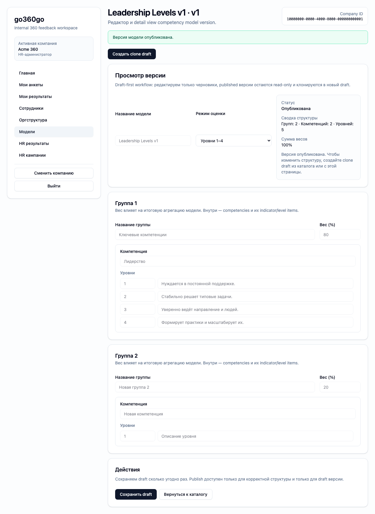

# FT-0172 — Model editor
Status: Completed (2026-03-06)

## User value
HR задаёт структуру модели оценки и публикует корректные версии без технических обходов.

## Deliverables
- Draft model editor for indicators/levels.
- Competency groups and weight validation.
- Publish/lock draft version flow.

## Context (SSoT links)
- [Competency models](../../../../../spec/domain/competency-models.md): canonical structure of groups/competencies/indicators/levels. Читать, чтобы editor не создавал invalid shapes.
- [Calculations](../../../../../spec/domain/calculations.md): why weights and score semantics matter. Читать, чтобы validation corresponded to reporting rules.
- [Stitch mapping — EP-017](../../../../../spec/ui/design-references-stitch.md#ep-017--competency-models-and-matrix-ui): section layout reference.

## Project grounding
- Проверить model draft/publish rules in core/client/CLI.
- Свериться with both indicators and levels variants.

## Implementation plan
- Build sectioned editor with validation hints.
- Keep model draft editing isolated from active versions.
- Provide publish flow only for valid drafts.

## Scenarios (auto acceptance)
### Setup
- Seed: `S3_model_indicators`, `S3_model_levels`.

### Action
1. Open draft model.
2. Add/edit group and competencies.
3. Validate.
4. Publish.

### Assert
- Invalid weights blocked.
- Correct draft publishes.
- Used versions remain immutable.

### Client API ops (v1)
- Model get/update/publish ops.

## Manual verification (deployed environment)
- `beta`: edit a draft model, trigger validation, then publish a valid version.

## Docs updates (SSoT)
- [UI sitemap & flows](../../../../../spec/ui/sitemap-and-flows.md)
- [Client API operation catalog](../../../../../spec/client-api/operation-catalog.md)
- [CLI command catalog](../../../../../spec/cli/command-catalog.md)

## Progress note (2026-03-06)
- Выполнен вертикальный слайс FT-0172:
  - `/hr/models/new` и `/hr/models/[modelVersionId]` дают draft-first editor для indicators/levels;
  - validation по сумме весов групп блокирует publish до исправления структуры;
  - published versions открываются read-only и могут быть продолжены только через clone draft.

## Quality checks evidence (2026-03-06)
- `pnpm checks` → passed.
- `pnpm --filter @feedback-360/cli test -- --runInBand src/ft-0171-models-matrix-cli.test.ts` → passed.

## Acceptance evidence (2026-03-06)
- Local acceptance:
  - `cd apps/web && PLAYWRIGHT_BASE_URL=http://127.0.0.1:3101 node ../../node_modules/@playwright/test/cli.js test --config playwright/playwright.config.mjs tests/ft-0172-model-editor.spec.ts --workers=1 --reporter=line` → passed.
- Beta acceptance:
  - `cd apps/web && PLAYWRIGHT_BASE_URL=https://beta.go360go.ru node ../../node_modules/@playwright/test/cli.js test --config playwright/playwright.config.mjs tests/ft-0172-model-editor.spec.ts --workers=1 --reporter=line` → passed after merge commit `5b7cdc5`.
- Covered acceptance:
  - HR открывает draft editor и меняет структуру модели;
  - invalid weights дают warning и блокируют publish;
  - valid draft сохраняется, публикуется и становится read-only.
- Artifacts:
  - model editor and publish flow.
    

## Manual verification (deployed environment)
### Beta scenario — model editor
- Environment:
  - URL: `https://beta.go360go.ru`
  - account: `hr_admin` with seeded company access
- Steps:
  1. Открыть `/hr/models/new?kind=levels`.
  2. Добавить группу, изменить веса так, чтобы сумма была не 100, и убедиться, что publish заблокирован.
  3. Вернуть сумму к 100, сохранить draft и опубликовать его.
  4. Убедиться, что после publish editor становится read-only.
- Expected:
  - warning появляется при неверной сумме весов;
  - save создаёт/обновляет draft;
  - publish переводит версию в `published` и блокирует дальнейшее редактирование.
- Result:
  - passed on `https://beta.go360go.ru`.
