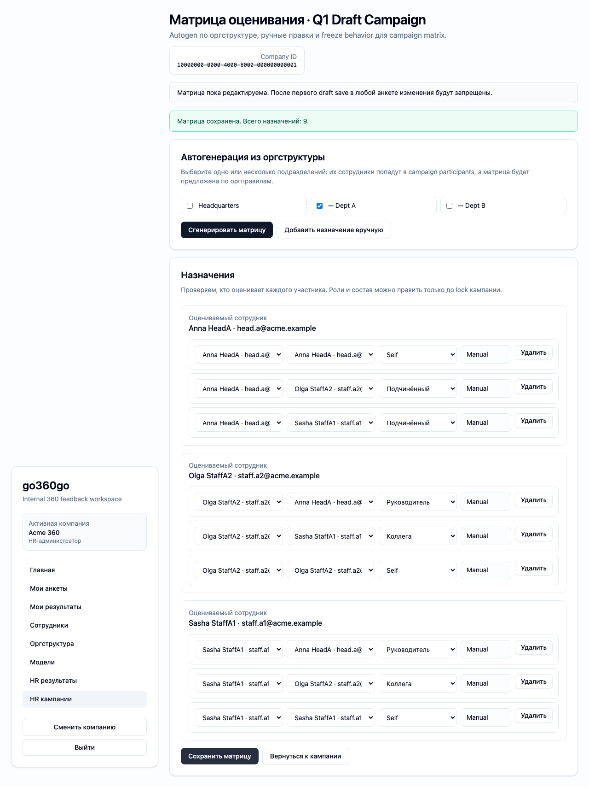
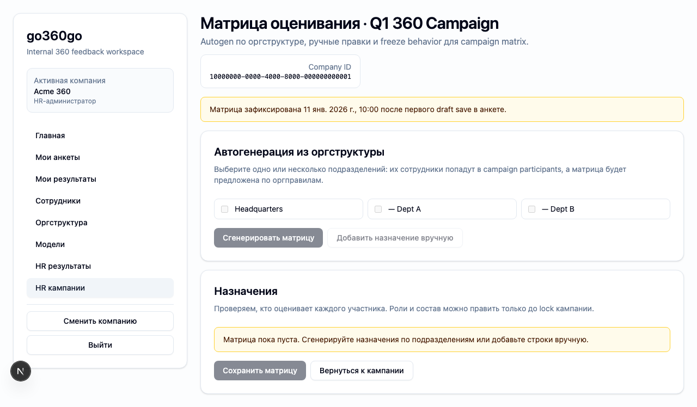

# FT-0173 — Matrix builder with freeze preview
Status: Completed (2026-03-06)

## User value
HR настраивает “кто кого оценивает” в понятном UI и заранее понимает, что произойдёт после lock.

## Deliverables
- Matrix builder UI.
- Autogenerate preview from org structure.
- Manual overrides and freeze warning banner.

## Context (SSoT links)
- [Assignments and matrix](../../../../../spec/domain/assignments-and-matrix.md): assignment groups and manual/autogen rules. Читать, чтобы builder соответствовал доменной модели.
- [Campaign lifecycle](../../../../../spec/domain/campaign-lifecycle.md): first draft-save lock semantics. Читать, чтобы preview and lock states были точными.
- [Stitch mapping — EP-017](../../../../../spec/ui/design-references-stitch.md#ep-017--competency-models-and-matrix-ui): people/tree patterns and action clusters.

## Project grounding
- Прочитать EP-003 autogen rules and FT-0084 current workbench.
- Проверить seeded org snapshot and lock scenarios.

## Implementation plan
- Add assignment preview grouped by role.
- Support autogen and manual edits before lock.
- Surface lock warning before and after first draft save.

## Scenarios (auto acceptance)
### Setup
- Seed: `S4_campaign_draft`, `S2_org_basic`, `S6_campaign_started_some_drafts`.

### Action
1. Generate matrix from org/departments.
2. Adjust peer assignments.
3. Reopen after first draft-save.

### Assert
- Preview matches org snapshot.
- Edits work before lock.
- After lock matrix becomes read-only with explanation.

### Client API ops (v1)
- Matrix generate/update/list and campaign lock state.

## Manual verification (deployed environment)
- `beta`: generate assignments, edit them, then verify lock after first questionnaire draft is saved.

## Docs updates (SSoT)
- [UI sitemap & flows](../../../../../spec/ui/sitemap-and-flows.md)
- [Client API operation catalog](../../../../../spec/client-api/operation-catalog.md)
- [CLI command catalog](../../../../../spec/cli/command-catalog.md)

## Progress note (2026-03-06)
- Выполнен вертикальный слайс FT-0173:
  - `/hr/campaigns/[campaignId]/matrix` даёт HR matrix builder с department-based autogen и manual save;
  - builder показывает lock banner до и после первого draft save и переводит locked campaigns в read-only state;
  - typed contract дополнился `matrix.list`, чтобы UI и CLI одинаково читали текущие assignments.

## Quality checks evidence (2026-03-06)
- `pnpm checks` → passed.
- `pnpm --filter @feedback-360/cli test -- --runInBand src/ft-0171-models-matrix-cli.test.ts` → passed.

## Acceptance evidence (2026-03-06)
- Local acceptance:
  - `cd apps/web && PLAYWRIGHT_BASE_URL=http://127.0.0.1:3101 node ../../node_modules/@playwright/test/cli.js test --config playwright/playwright.config.mjs tests/ft-0173-matrix-builder.spec.ts --workers=1 --reporter=line` → passed.
- Beta acceptance:
  - `cd apps/web && PLAYWRIGHT_BASE_URL=https://beta.go360go.ru node ../../node_modules/@playwright/test/cli.js test --config playwright/playwright.config.mjs tests/ft-0173-matrix-builder.spec.ts --workers=1 --reporter=line` → passed after merge commit `5b7cdc5`.
- Covered acceptance:
  - HR генерирует assignments из выбранных подразделений;
  - сохранение матрицы работает до lock;
  - locked campaign показывает read-only controls и объяснение freeze semantics.
- Artifacts:
  - editable matrix builder.
    
  - locked matrix builder.
    

## Manual verification (deployed environment)
### Beta scenario — matrix builder
- Environment:
  - URL: `https://beta.go360go.ru`
  - account: `hr_admin` with seeded company access
- Steps:
  1. Открыть draft campaign detail и перейти на `/hr/campaigns/[campaignId]/matrix`.
  2. Выбрать подразделение, сгенерировать assignments и сохранить matrix.
  3. Открыть started campaign со сделанным questionnaire draft и проверить lock banner.
- Expected:
  - builder показывает generated assignments по оргструктуре;
  - save подтверждает количество назначений;
  - после первого questionnaire draft matrix controls становятся disabled.
- Result:
  - passed on `https://beta.go360go.ru`.
