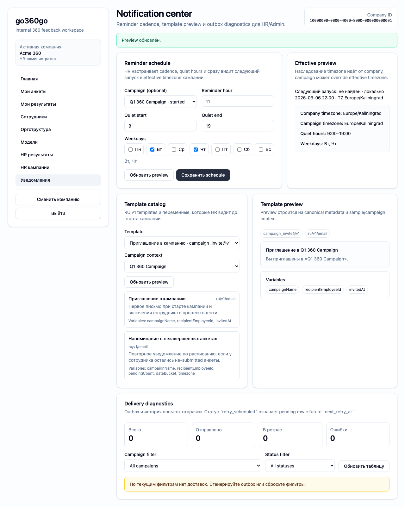

# FT-0181 — Reminder schedule editor
Status: Completed (2026-03-06)

## User value
HR настраивает reminders в UI и видит, когда система реально отправит сообщения.

## Deliverables
- Schedule editor.
- Timezone-aware next-run preview.
- Quiet hours and override hints.

## Context (SSoT links)
- [Notifications](../../../../../spec/notifications/notifications.md): reminder events and trigger semantics. Читать, чтобы editor corresponded to actual send model.
- [Outbox and retries](../../../../../spec/notifications/outbox-and-retries.md): scheduler/output behavior. Читать, чтобы preview and diagnostics matched reality.
- [Stitch mapping — EP-018](../../../../../spec/ui/design-references-stitch.md#ep-018--notification-center-ui): no direct mock, use only generic admin patterns.

## Project grounding
- Проверить current reminder config model and CLI flows.
- Свериться with company/campaign timezone rules.

## Implementation plan
- Add schedule form with preview.
- Explain timezone inheritance and overrides.
- Validate impossible or noisy configurations.

## Scenarios (auto acceptance)
### Setup
- Seed: `S5_campaign_started_no_answers`, `S6_campaign_started_some_drafts`.

### Action
1. Open reminder settings.
2. Change cadence/time.
3. Check preview.

### Assert
- Preview honors timezone and quiet hours.
- Invalid configurations blocked.

### Client API ops (v1)
- Reminder schedule get/update/preview ops.

## Manual verification (deployed environment)
- `beta`: edit reminder settings and confirm next-run preview updates correctly.

## Docs updates (SSoT)
- [UI sitemap & flows](../../../../../spec/ui/sitemap-and-flows.md)
- [Client API operation catalog](../../../../../spec/client-api/operation-catalog.md)
- [CLI spec](../../../../../spec/cli/cli.md)

## Progress note (2026-03-06)
- Выполнен вертикальный слайс FT-0181:
  - `/hr/notifications` даёт HR form для `scheduledHour`, weekdays и quiet hours;
  - preview строится через typed operation `notifications.settings.preview` и показывает timezone-aware ближайшие отправки;
  - сохранение reminder settings не требует CLI и не ломает existing outbox semantics.

## Quality checks evidence (2026-03-06)
- `pnpm lint` → passed.
- `pnpm typecheck` → passed.
- `pnpm --filter @feedback-360/web test` → passed.
- `pnpm --filter @feedback-360/web build` → passed.

## Acceptance evidence (2026-03-06)
- Local acceptance:
  - `PLAYWRIGHT_BASE_URL=http://127.0.0.1:3104 pnpm --filter @feedback-360/web exec playwright test --config playwright/playwright.config.mjs tests/ft-0181-reminder-schedule-editor.spec.ts --workers=1` → passed.
- Beta acceptance:
  - `PLAYWRIGHT_BASE_URL=https://beta.go360go.ru pnpm --filter @feedback-360/web exec playwright test --config playwright/playwright.config.mjs tests/ft-0181-reminder-schedule-editor.spec.ts --workers=1` → passed after merge commit `5218179`.
- Covered acceptance:
  - HR меняет cadence и quiet hours без выхода из active company context;
  - preview отражает timezone-aware ближайшие отправки и quiet-hours window;
  - invalid/error state не протекает в UI после успешного сохранения.
- Artifacts:
  - reminder editor and next-run preview.
    

## Manual verification (deployed environment)
### Beta scenario — reminder schedule editor
- Environment:
  - URL: `https://beta.go360go.ru`
  - account: seeded `hr_admin`
- Steps:
  1. Войти по magic link и выбрать активную компанию.
  2. Открыть `/hr/notifications`.
  3. В секции reminder settings изменить `scheduled hour`, weekdays или quiet hours.
  4. Нажать preview/save и дождаться обновления следующей отправки.
- Expected:
  - form остаётся в HR scope;
  - preview показывает ближайшие ISO-slots в timezone кампании/компании;
  - в карточке видно quiet-hours explanation без error banner.
- Result:
  - passed on `https://beta.go360go.ru`.
