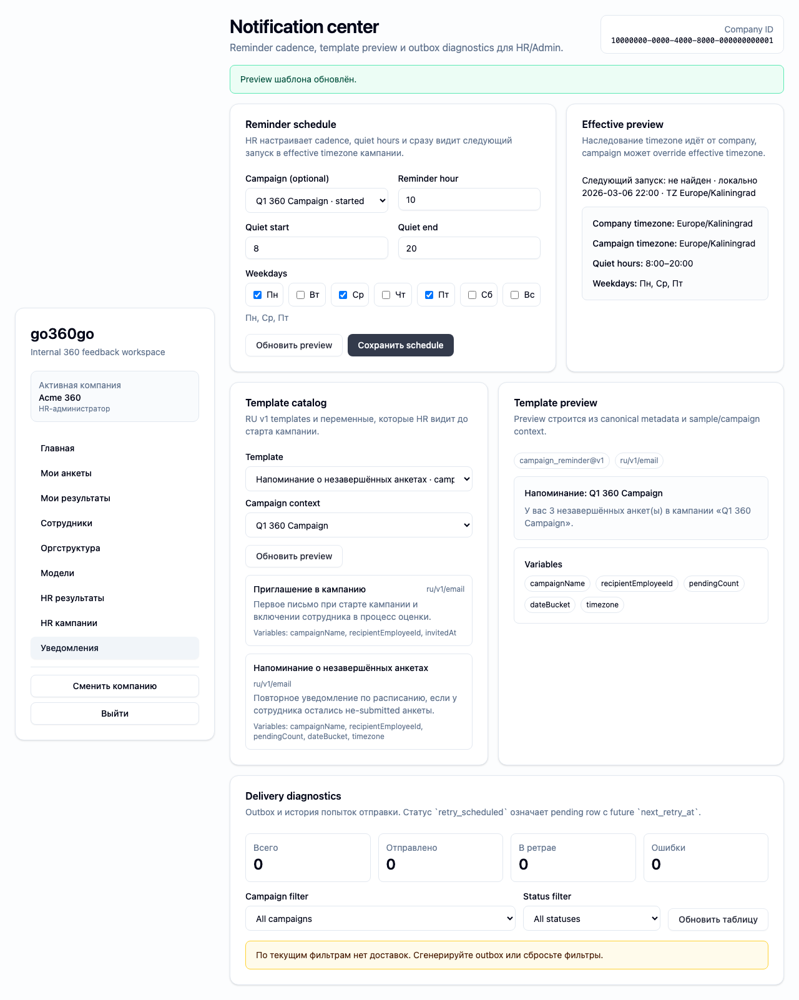

# FT-0182 — Template catalog and preview
Status: Completed (2026-03-06)

## User value
HR понимает, какие письма отправляет система и что увидит сотрудник до старта кампании.

## Deliverables
- Template list.
- Preview screen with sample data.
- Variables list and locale/version metadata.

## Context (SSoT links)
- [Templates RU v1](../../../../../spec/notifications/templates-ru-v1.md): canonical template set. Читать, чтобы preview corresponded to the real templates.
- [Localization](../../../../../spec/notifications/localization.md): current RU-only scope and future locale expansion. Читать, чтобы UI не обещал лишнее.
- [Stitch mapping — EP-018](../../../../../spec/ui/design-references-stitch.md#ep-018--notification-center-ui): generic admin patterns only.

## Project grounding
- Проверить current template metadata and available placeholders.
- Свериться with user-facing wording in glossary/spec.

## Implementation plan
- Build template catalog and preview panel.
- Show variables and version labels.
- Mark unsupported locales explicitly.

## Scenarios (auto acceptance)
### Setup
- Seed: notifications template metadata fixtures.

### Action
1. Open template catalog.
2. Select `campaign_invite` / `campaign_reminder`.
3. Inspect preview and variables.

### Assert
- Preview uses canonical template metadata.
- Variables list accurate.
- Locale support clearly labeled.

### Client API ops (v1)
- Template catalog/preview ops.

## Manual verification (deployed environment)
- `beta`: open template preview and compare expected wording/variables before sending a campaign.

## Docs updates (SSoT)
- [UI sitemap & flows](../../../../../spec/ui/sitemap-and-flows.md)
- [Client API operation catalog](../../../../../spec/client-api/operation-catalog.md)
- [CLI command catalog](../../../../../spec/cli/command-catalog.md)

## Progress note (2026-03-06)
- Выполнен вертикальный слайс FT-0182:
  - notification center показывает template catalog с version/locale metadata;
  - preview письма и variables list приходят через typed operations `notifications.templates.list|preview`;
  - HR может до старта кампании проверить wording и placeholder coverage без тестовой отправки.

## Quality checks evidence (2026-03-06)
- `pnpm lint` → passed.
- `pnpm typecheck` → passed.
- `pnpm --filter @feedback-360/web test` → passed.
- `pnpm --filter @feedback-360/cli exec vitest run src/ft-0181-notification-center-cli.test.ts` → passed.

## Acceptance evidence (2026-03-06)
- Local acceptance:
  - `PLAYWRIGHT_BASE_URL=http://127.0.0.1:3104 pnpm --filter @feedback-360/web exec playwright test --config playwright/playwright.config.mjs tests/ft-0182-template-catalog.spec.ts --workers=1` → passed.
- Beta acceptance:
  - `PLAYWRIGHT_BASE_URL=https://beta.go360go.ru pnpm --filter @feedback-360/web exec playwright test --config playwright/playwright.config.mjs tests/ft-0182-template-catalog.spec.ts --workers=1` → passed after merge commit `5218179`.
- Covered acceptance:
  - HR открывает catalog и видит `campaign_invite` / `campaign_reminder` templates;
  - preview показывает canonical subject/body/html snapshot и variables list;
  - unsupported locales не появляются как доступные actions.
- Artifacts:
  - template catalog and preview panel.
    

## Manual verification (deployed environment)
### Beta scenario — template catalog
- Environment:
  - URL: `https://beta.go360go.ru`
  - account: seeded `hr_admin`
- Steps:
  1. Войти по magic link и выбрать активную компанию.
  2. Открыть `/hr/notifications`.
  3. В секции template catalog выбрать `campaign_invite` и затем `campaign_reminder`.
  4. Сверить preview subject/body и variables.
- Expected:
  - catalog остаётся в пределах active company;
  - preview показывает RU v1 wording и список placeholders;
  - переключение template key не ломает layout и не требует reload page.
- Result:
  - passed on `https://beta.go360go.ru`.
