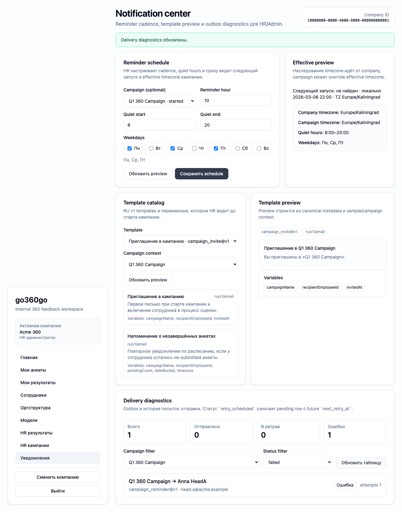

# FT-0183 — Delivery diagnostics and outbox view
Status: Completed (2026-03-06)

## User value
HR/Admin видит, были ли отправлены письма, какие упали в retry/fail и почему.

## Deliverables
- Outbox/delivery table.
- Filters by campaign/status/channel.
- Attempt drill-down and retry state markers.

## Context (SSoT links)
- [Outbox and retries](../../../../../spec/notifications/outbox-and-retries.md): pending/retrying/sent/dead semantics. Читать, чтобы diagnostics labels были корректными.
- [Notifications](../../../../../spec/notifications/notifications.md): campaign event types and channels. Читать, чтобы filters matched the actual notification model.
- [Stitch mapping — EP-018](../../../../../spec/ui/design-references-stitch.md#ep-018--notification-center-ui): generic operational table patterns.

## Project grounding
- Проверить outbox tables and current CLI diagnostics.
- Свериться with permission model for HR/Admin readers.

## Implementation plan
- Add delivery diagnostics page with drill-down.
- Surface status badges and attempt history.
- Keep operations read-only unless explicit retry action later appears in spec.

## Scenarios (auto acceptance)
### Setup
- Seed: notification outbox data with sent/failed/retrying states.

### Action
1. Open diagnostics.
2. Filter by failed/retrying.
3. Expand a delivery item.

### Assert
- Statuses and attempts match outbox data.
- Campaign and recipient context visible.
- Retrying vs terminal failure distinguishable.

### Client API ops (v1)
- Notification diagnostics read ops.

## Manual verification (deployed environment)
- `beta`: inspect failed and retrying deliveries for a test campaign.

## Docs updates (SSoT)
- [UI sitemap & flows](../../../../../spec/ui/sitemap-and-flows.md)
- [Client API operation catalog](../../../../../spec/client-api/operation-catalog.md)
- [CLI command catalog](../../../../../spec/cli/command-catalog.md)

## Progress note (2026-03-06)
- Выполнен вертикальный слайс FT-0183:
  - notification center получил delivery table с filters по status/channel/campaign;
  - drill-down показывает attempts history, retry markers и terminal failures;
  - diagnostics читаются тем же contract, что и CLI, поэтому GUI и ops helper не расходятся по данным.

## Quality checks evidence (2026-03-06)
- `pnpm lint` → passed.
- `pnpm typecheck` → passed.
- `pnpm --filter @feedback-360/web test` → passed.
- `pnpm --filter @feedback-360/cli exec vitest run src/ft-0181-notification-center-cli.test.ts` → passed.

## Acceptance evidence (2026-03-06)
- Local acceptance:
  - `PLAYWRIGHT_BASE_URL=http://127.0.0.1:3104 pnpm --filter @feedback-360/web exec playwright test --config playwright/playwright.config.mjs tests/ft-0183-delivery-diagnostics.spec.ts --workers=1` → passed.
- Beta acceptance:
  - `PLAYWRIGHT_BASE_URL=https://beta.go360go.ru pnpm --filter @feedback-360/web exec playwright test --config playwright/playwright.config.mjs tests/ft-0183-delivery-diagnostics.spec.ts --workers=1` → passed after merge commit `5218179`.
- Covered acceptance:
  - HR видит seeded rows в состояниях `sent`, `retry_scheduled`, `failed`;
  - filters не ломают diagnostics и позволяют открыть конкретную delivery card;
  - attempts history различает retryable failure и terminal failure.
- Artifacts:
  - delivery diagnostics with retry and failed attempts.
    

## Manual verification (deployed environment)
### Beta scenario — delivery diagnostics
- Environment:
  - URL: `https://beta.go360go.ru`
  - account: seeded `hr_admin`
- Steps:
  1. Войти по magic link и выбрать активную компанию.
  2. Открыть `/hr/notifications`.
  3. Дождаться fixture cards в diagnostics table.
  4. Отфильтровать `retry_scheduled` / `failed` и раскрыть attempts history.
- Expected:
  - diagnostics показывает campaign, recipient, status badge и scheduled/delivered timestamps;
  - `retry_scheduled` видно отдельно от terminal `failed`;
  - attempts history раскрывается без навигации на другой экран.
- Result:
  - passed on `https://beta.go360go.ru`.
