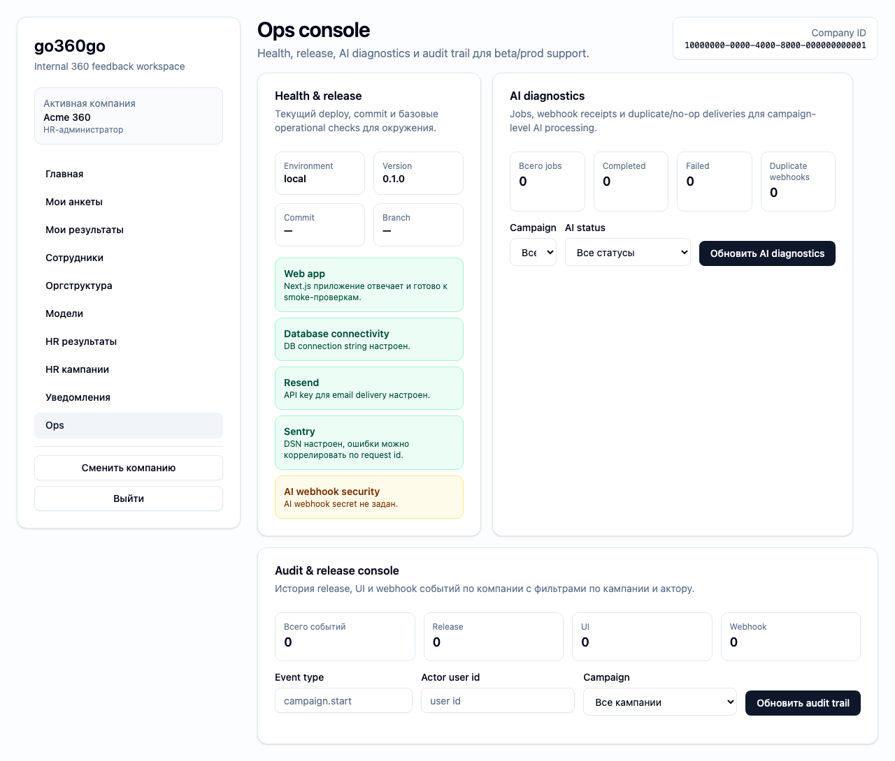

# FT-0191 — Health and release dashboard
Status: Completed (2026-03-06)

## User value
Команда быстро видит, в каком состоянии beta/prod, какой build задеплоен и прошёл ли последний smoke.

## Deliverables
- Environment health cards.
- Build/deploy metadata.
- Latest CI/smoke status panel.

## Context (SSoT links)
- [Deployment architecture](../../../../../spec/operations/deployment-architecture.md): beta/prod topology and ownership. Читать, чтобы dashboard показывал правильные environments.
- [Runbook](../../../../../spec/operations/runbook.md): operational checks and release path. Читать, чтобы UI signals matched runbook language.
- [Stitch mapping — EP-019](../../../../../spec/ui/design-references-stitch.md#ep-019--admin-and-ops-ui): generic dashboard/status patterns.

## Project grounding
- Проверить what health/build/smoke metadata already available.
- Свериться with existing CI/beta smoke evidence.

## Implementation plan
- Add ops dashboard page.
- Surface deployment/build metadata and latest smoke result.
- Link to deeper runbook steps when something is red.

## Scenarios (auto acceptance)
### Setup
- Local mocked health/deploy data.

### Action
1. Open ops dashboard.
2. Refresh/reload state.

### Assert
- Build SHA and environment shown.
- Smoke status visible.
- Red state clearly distinguishable.

### Client API ops (v1)
- Health/deploy/CI status read adapters.

## Manual verification (deployed environment)
- `beta`: compare ops dashboard with Vercel/GitHub status for the same build.

## Docs updates (SSoT)
- [UI sitemap & flows](../../../../../spec/ui/sitemap-and-flows.md)
- [Client API operation catalog](../../../../../spec/client-api/operation-catalog.md)
- [CLI spec](../../../../../spec/cli/cli.md)

## Progress note (2026-03-06)
- Добавлен `/ops` с карточкой `Health & release` для HR ролей.
- Health card показывает `appEnv`, version, git metadata и состояние базовых integration checks.
- Навигация в internal shell получила отдельный `Ops` entrypoint.

## Quality checks evidence (2026-03-06)
- `pnpm --filter @feedback-360/web lint` → passed.
- `pnpm --filter @feedback-360/web typecheck` → passed.
- `pnpm --filter @feedback-360/web build` → passed.

## Acceptance evidence (2026-03-06)
- Local acceptance:
  - `PLAYWRIGHT_BASE_URL=http://127.0.0.1:3107 pnpm --filter @feedback-360/web exec playwright test --config playwright/playwright.config.mjs tests/ft-0191-health-release-dashboard.spec.ts --workers=1` → passed.
- Beta acceptance:
  - `PLAYWRIGHT_BASE_URL=https://beta.go360go.ru pnpm --filter @feedback-360/web exec playwright test --config playwright/playwright.config.mjs tests/ft-0191-health-release-dashboard.spec.ts --workers=1` → passed after merge commit `0f4bf1c`.
- Covered acceptance:
  - HR role открывает `/ops` после seed/login/company selection.
  - На странице видны `Health & release`, environment, build metadata и operational checks.
- Artifacts:
  - health and release dashboard.
    

## Manual verification (deployed environment)
### Beta scenario — health and release dashboard
- Environment:
  - URL: `https://beta.go360go.ru`
  - account: seeded `hr_admin`
- Steps:
  1. Войти по magic link и выбрать активную компанию.
  2. Открыть `/ops`.
  3. Проверить блок `Health & release`.
- Expected:
  - видны environment/version/commit/branch;
  - checks для web/db присутствуют;
  - warning/healthy states читаемы визуально.
- Result:
  - passed on `https://beta.go360go.ru`.
