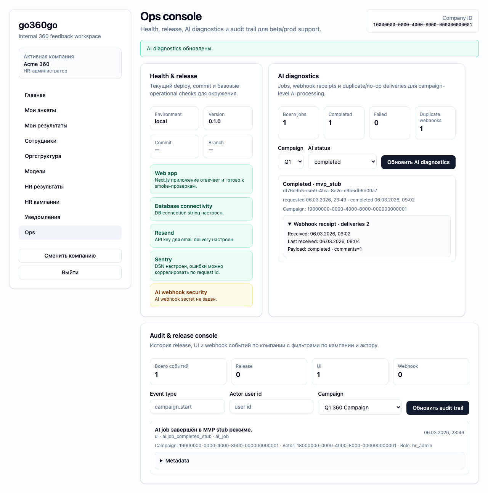

# FT-0192 — AI jobs and webhook diagnostics
Status: Completed (2026-03-06)

## User value
HR Admin/ops быстро понимают, что происходит с AI jobs и почему campaign в `processing_ai` или `ai_failed`.

## Deliverables
- AI jobs table.
- Webhook receipt drill-down.
- Idempotency/retry markers and campaign linkbacks.

## Context (SSoT links)
- [AI processing](../../../../../spec/ai/ai-processing.md): job lifecycle. Читать, чтобы statuses and actions matched campaign behavior.
- [Webhook security](../../../../../spec/security/webhooks-ai.md): idempotency and retry semantics. Читать, чтобы diagnostics correctly explained receipts.
- [Stitch mapping — EP-019](../../../../../spec/ui/design-references-stitch.md#ep-019--admin-and-ops-ui): generic operational table patterns.

## Project grounding
- Проверить current AI stub/job data and webhook receipts.
- Свериться with HR/Admin visibility boundaries.

## Implementation plan
- Add AI diagnostics page or module inside ops.
- Surface job status timeline and receipt info.
- Highlight no-op duplicate receipts separately.

## Scenarios (auto acceptance)
### Setup
- Seed: `S9_campaign_completed_with_ai`, `ai_failed` variant, webhook receipt fixtures.

### Action
1. Open AI diagnostics.
2. Filter by campaign/status.
3. Expand receipts.

### Assert
- Job and campaign statuses consistent.
- Duplicate receipt labeled as idempotent no-op.
- Failed reasons visible.

### Client API ops (v1)
- AI jobs and webhook diagnostics read ops.

## Manual verification (deployed environment)
- `beta`: compare one completed and one failed AI campaign in diagnostics.

## Docs updates (SSoT)
- [UI sitemap & flows](../../../../../spec/ui/sitemap-and-flows.md)
- [Client API operation catalog](../../../../../spec/client-api/operation-catalog.md)
- [CLI spec](../../../../../spec/cli/cli.md)

## Progress note (2026-03-06)
- В ops console добавлен AI diagnostics section с campaign/status filters.
- Диагностика показывает `aiJobId`, provider, status, completed timestamp и webhook receipt summary.
- Duplicate receipts отображаются через `deliveryCount` и payload drill-down.

## Quality checks evidence (2026-03-06)
- `pnpm --filter @feedback-360/cli exec vitest run src/ft-019-ops-cli.test.ts` → passed.
- `pnpm --filter @feedback-360/web lint` → passed.
- `pnpm --filter @feedback-360/web typecheck` → passed.
- `pnpm --filter @feedback-360/web build` → passed.

## Acceptance evidence (2026-03-06)
- Local acceptance:
  - `PLAYWRIGHT_BASE_URL=http://127.0.0.1:3107 pnpm --filter @feedback-360/web exec playwright test --config playwright/playwright.config.mjs tests/ft-0192-ai-diagnostics.spec.ts --workers=1` → passed.
- Beta acceptance:
  - `PLAYWRIGHT_BASE_URL=https://beta.go360go.ru pnpm --filter @feedback-360/web exec playwright test --config playwright/playwright.config.mjs tests/ft-0192-ai-diagnostics.spec.ts --workers=1` → passed after merge commit `0f4bf1c`.
- Covered acceptance:
  - HR admin инициирует/читает AI diagnostics для seeded campaign.
  - Dev webhook fixture создаёт duplicate delivery и UI показывает `deliveries 2`.
  - Receipt payload раскрывается без рассинхронизации campaign/job status.
- Artifacts:
  - AI diagnostics with duplicate webhook receipt.
    

## Manual verification (deployed environment)
### Beta scenario — AI diagnostics
- Environment:
  - URL: `https://beta.go360go.ru`
  - account: seeded `hr_admin`
- Steps:
  1. Войти по magic link и выбрать активную компанию.
  2. Открыть `/ops`.
  3. В блоке `AI diagnostics` выбрать campaign/status и обновить список.
  4. Раскрыть receipt details.
- Expected:
  - jobs согласованы со status кампании;
  - duplicate deliveries помечены счётчиком;
  - receipt payload summary читаем.
- Result:
  - passed on `https://beta.go360go.ru`.
