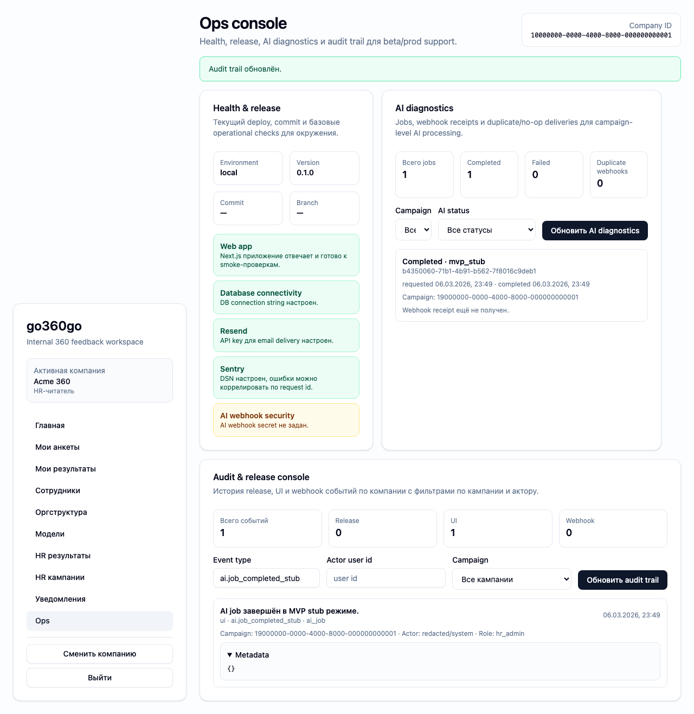

# FT-0193 — Audit trail and release console
Status: Completed (2026-03-06)

## User value
Команда может проследить, кто и когда менял кампанию, матрицу, уведомления или запускал AI retry.

## Deliverables
- Audit events table with filters.
- Release event panel.
- Deep links to affected campaign/user objects.

## Context (SSoT links)
- [RBAC](../../../../../spec/security/rbac.md): кто должен видеть audit/ops data. Читать, чтобы diagnostics не раскрывали лишнее.
- [Runbook](../../../../../spec/operations/runbook.md): release/recovery steps and terminology. Читать, чтобы release console использовал те же operational concepts.
- [Stitch mapping — EP-019](../../../../../spec/ui/design-references-stitch.md#ep-019--admin-and-ops-ui): generic diagnostics tables/cards.

## Project grounding
- Проверить current audit signals/evidence sources.
- Свериться with release traceability standards and git/deploy docs.

## Implementation plan
- Build searchable audit console.
- Add actor/action/campaign/date filters.
- Surface release events next to business audit events without mixing permissions.

## Scenarios (auto acceptance)
### Setup
- Seed: audit fixtures around campaign start, matrix change, reminder dispatch, AI retry.

### Action
1. Open audit console.
2. Filter by campaign and actor.
3. Open a release event.

### Assert
- Event order deterministic.
- Metadata sufficient to reconstruct who/what/when.
- Restricted fields redacted by role.

### Client API ops (v1)
- Audit/release diagnostics read ops.

## Manual verification (deployed environment)
- `beta`: find events for one known campaign lifecycle and compare with actual UI actions/runbook evidence.

## Docs updates (SSoT)
- [UI sitemap & flows](../../../../../spec/ui/sitemap-and-flows.md)
- [Client API operation catalog](../../../../../spec/client-api/operation-catalog.md)
- [CLI spec](../../../../../spec/cli/cli.md)

## Progress note (2026-03-06)
- В ops console добавлен `Audit & release console` с filters по event type, actor и campaign.
- `hr_reader` получает redacted actor metadata для non-release событий.
- Release/UI/webhook события живут в одной шкале, но redaction obeys role boundary.

## Quality checks evidence (2026-03-06)
- `pnpm --filter @feedback-360/web lint` → passed.
- `pnpm --filter @feedback-360/web typecheck` → passed.
- `pnpm --filter @feedback-360/web build` → passed.

## Acceptance evidence (2026-03-06)
- Local acceptance:
  - `PLAYWRIGHT_BASE_URL=http://127.0.0.1:3107 pnpm --filter @feedback-360/web exec playwright test --config playwright/playwright.config.mjs tests/ft-0193-audit-console.spec.ts --workers=1` → passed.
- Beta acceptance:
  - `PLAYWRIGHT_BASE_URL=https://beta.go360go.ru pnpm --filter @feedback-360/web exec playwright test --config playwright/playwright.config.mjs tests/ft-0193-audit-console.spec.ts --workers=1` → passed after merge commit `0f4bf1c`.
- Covered acceptance:
  - `hr_admin` creates an AI audit signal through real `ai.runForCampaign`.
  - `hr_reader` filters audit console by event type and sees redacted actor/metadata.
  - audit rows remain ordered and drill-down metadata is readable.
- Artifacts:
  - audit console with redacted event detail.
    

## Manual verification (deployed environment)
### Beta scenario — audit and release console
- Environment:
  - URL: `https://beta.go360go.ru`
  - accounts: seeded `hr_admin`, `hr_reader`
- Steps:
  1. Под `hr_admin` выполнить одно HR действие, которое оставляет audit signal.
  2. Под `hr_reader` открыть `/ops`.
  3. В блоке `Audit & release console` отфильтровать event type.
  4. Раскрыть metadata.
- Expected:
  - `hr_reader` видит событие, но actor и metadata redacted для non-release source;
  - audit order детерминированный и campaign filter работает.
- Result:
  - passed on `https://beta.go360go.ru`.
