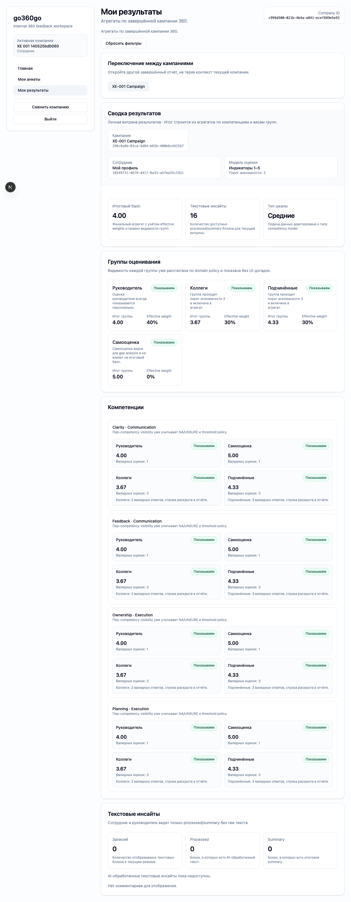
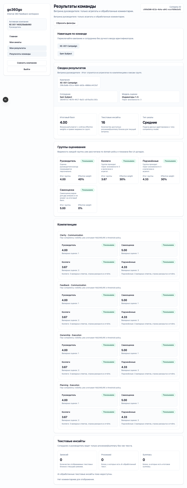
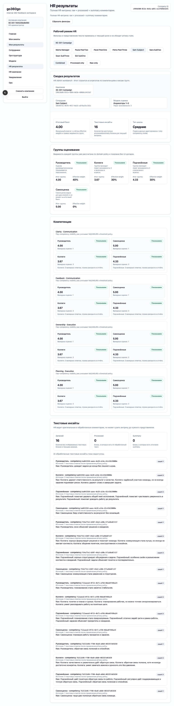

# FT-0206 — UI automation contract
Status: Completed (2026-03-07)

Пользовательская ценность: GUI-фазы сценариев управляются надёжно и не ломаются от незначительных визуальных изменений.

Deliverables:
- screen spec policy
- POM catalog policy
- `data-testid` naming convention
- browser session/profile strategy for XE actors
- artifact capture rules for GUI phases
- test-only auth bootstrap → browser session flow

Acceptance scenario:
- для ключевых экранов `XE-001` существуют screen spec + POM
- POM использует стабильные `data-testid`
- раннер может открыть две разные actor sessions последовательно без GUI login flow

## Progress note (2026-03-07)
- В memory bank зафиксированы `screen specs` и POM conventions, а XE runner использует отдельный `storage-state` и browser context на каждого actor.
- Для `XE-001` runner снимает screenshots employee/manager/HR results, подтверждая работоспособность UI contract на реальных sessions.

## Quality checks evidence (2026-03-07)
- `pnpm --filter @feedback-360/xe-runner lint` → passed.
- `pnpm --filter @feedback-360/xe-runner typecheck` → passed.
- `pnpm --filter @feedback-360/xe-runner test` → passed.

## Acceptance evidence (2026-03-07)
- Automated:
  - `pnpm --filter @feedback-360/cli cli -- xe runs run XE-001 --env beta --owner codex --base-url https://beta.go360go.ru --json` → passed.
- Covered acceptance:
  - `subject`, `manager`, `hr_admin` используют независимые browser sessions;
  - POM-driven capture проходит без GUI login flow;
  - итоговые screenshots совпадают с screen spec ownership (`employee`, `team`, `HR` results).
- Artifacts:
  - employee dashboard screenshot.
    
  - manager dashboard screenshot.
    
  - HR dashboard screenshot.
    
