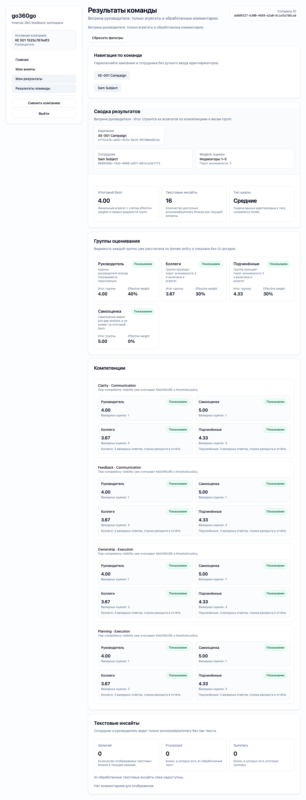

# FT-0207 — XE-001 first campaign happy path
Status: Completed (2026-03-07)

Пользовательская ценность: система получает первый доказуемый сквозной сценарий, который проверяет основной пользовательский путь 360-кампании от HR setup до результатов.

Deliverables:
- scenario materials in `scenarios/XE-001-first-campaign/`
- fixtures for actors/org/answers/expected results
- local execution path
- beta execution path
- evidence bundle for successful run

Acceptance scenario:
- `XE-001` запускается через CLI на `local`
- сценарий создаёт компанию/оргструктуру/модель/кампанию
- actors получают session bootstrap и заполняют анкеты по fixture
- results совпадают с expected fixture
- тот же сценарий исполним на `beta` с теми же фазами и artifacts

## Progress note (2026-03-07)
- `XE-001` доведён до полностью детерминированного happy path: seed → start campaign → bootstrap sessions → submit questionnaires → verify results.
- Сценарий использует fixtures из `scenarios/XE-001/`, сохраняет state/artifacts и проверяет expected aggregates и visibility на `local` и `beta`.

## Quality checks evidence (2026-03-07)
- `pnpm --filter @feedback-360/db test` → passed.
- `pnpm --filter @feedback-360/xe-runner test` → passed.
- `pnpm --filter @feedback-360/cli test` → passed.

## Acceptance evidence (2026-03-07)
- Local acceptance:
  - `pnpm --filter @feedback-360/cli cli -- xe runs run XE-001 --env local --owner codex --base-url http://127.0.0.1:3105 --json` → passed (`RUN-20260307121405-25bdb060`).
- Beta acceptance:
  - `pnpm --filter @feedback-360/cli cli -- xe runs run XE-001 --env beta --owner codex --base-url https://beta.go360go.ru --json` → passed (`RUN-20260307121525-c767edf3`).
- Covered acceptance:
  - HR инициализирует полную 360-компанию и система создаёт invite intents;
  - все 8 questionnaires проходят deterministic draft+submit flow;
  - итоговые employee/manager/HR results совпадают с `expected-results.json`;
  - scenario artifacts пригодны для расследования без повторного запуска.
- Artifacts:
  - employee results on beta.
    
  - manager results on beta.
    
  - HR results on beta.
    
