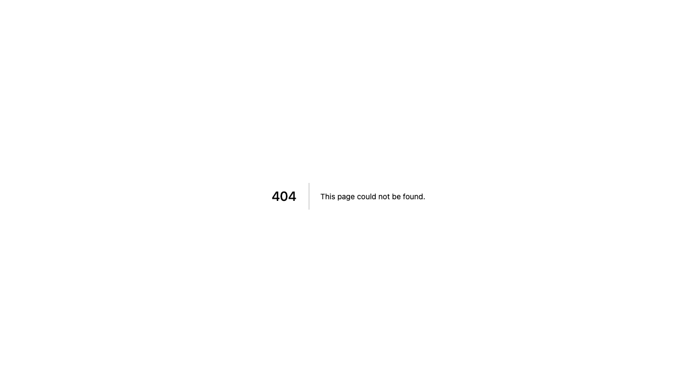
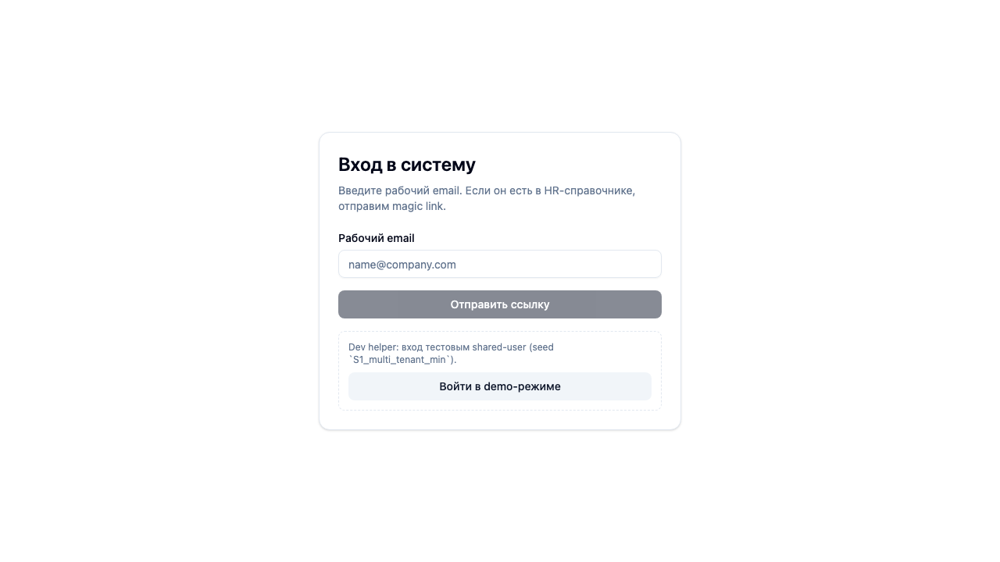
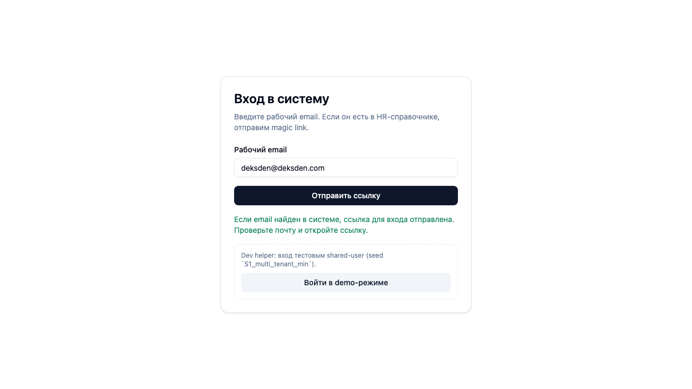

# Deployment / Runbook
Status: Draft (2026-03-04)

## Purpose
Операционный чеклист для запуска и поддержки beta/prod окружений без потери консистентности.

## References (SSoT)
- [Git flow](git-flow.md) — как продвигаем изменения между ветками и окружениями. Читать перед релизом, чтобы не нарушить процесс промоушена.
- [Deployment architecture](deployment-architecture.md) — где расположены сервисы и какие env vars обязательны. Читать перед настройкой окружения.
- [Domains & DNS](domains-and-dns.md) — текущие DNS записи и проверка deliverability. Читать при любых изменениях домена/почты.

## Release checklist
1. Merge feature PR into `develop`.
2. Verify required GitHub checks for merge commit in `develop` are `success`.
   - минимум: workflow `ci.yml` (`checks`).
   - если появились дополнительные required checks — все должны быть зелёными.
3. Verify beta deployment (`beta.go360go.ru`):
   - app health endpoint
   - auth redirect and magic-link flow
   - core smoke scenarios (seed/migrations/tests)
   - browser smoke via `$agent-browser` for changed user-facing paths (with screenshots in evidence)
   - Vercel deployment status: `Ready` (без build/runtime errors).
4. Merge `develop -> main`.
5. Verify production deployment (`go360go.ru`) with smoke checks:
   - required GitHub checks on merge commit in `main` = `success`,
   - Vercel deployment status for `go360go-prod` = `Ready`.

### Automated beta smoke (mandatory)
- Workflow: `.github/workflows/beta-smoke.yml` (trigger: push in `develop` + manual dispatch).
- Scope (MVP baseline): `select-company` loading path on real beta domain via Playwright.
- Required secret: `BETA_SMOKE_USER_ID` (provisioned user with memberships).
- Reason: catches runtime drift between local tests and real beta environment (DB/env/deploy mismatches).

## CI/CD verification commands (operator quick-check)
- GitHub Actions (latest runs):
  - `gh run list --repo deksden-com/feedback-360 --workflow ci.yml --limit 10`
  - `gh run view <run-id> --repo deksden-com/feedback-360`
- Commit checks:
  - `gh api repos/deksden-com/feedback-360/commits/<sha>/check-runs`
- Branch protection:
  - `gh api repos/deksden-com/feedback-360/branches/develop/protection`
  - `gh api repos/deksden-com/feedback-360/branches/main/protection`
- Vercel deployments:
  - `vercel list go360go-beta`
  - `vercel list go360go-prod`
  - `vercel inspect <deployment-url> --logs`
- Browser smoke (`agent-browser`):
  - `agent-browser open https://beta.go360go.ru && agent-browser wait --load networkidle && agent-browser snapshot -i`
  - `agent-browser screenshot --full`

## Check failure handling (fix-loop)
- Если CI/check-run в GitHub failed: исправляем причину, запускаем новый run, обновляем evidence ссылкой на зелёный run.
- Если deployment в Vercel failed: читаем `vercel inspect --logs`, фиксируем root cause, исправляем конфигурацию/код, повторяем deploy до `Ready`.
- До зелёного состояния merge/release не продолжаем.

## Current status snapshot (2026-03-04, after CI/CD hardening)
- GitHub Actions (`ci.yml`) на `develop`: `success` (последний проверенный run на дату снимка).
- Branch protection: включена для `develop` и `main`:
  - required checks: `checks`, `Vercel Preview Comments`,
  - merge только через PR, force-push/delete запрещены, conversation resolution включён.
- Vercel projects:
  - `go360go-beta` и `go360go-prod` переведены на `framework=nextjs`, build/dev команды: `pnpm build` / `pnpm dev`, root directory=`apps/web`.
  - `go360go-beta` требует финальной синхронизации `productionBranch=develop` (сейчас в API состоянии ещё `main`).
  - после настройки последний deployment `go360go-beta` имеет статус `Ready` (production target),
  - последний deployment `go360go-prod` имеет статус `Ready` (preview target).
  - root cause empty-output зафиксирован: `vercel build` в cloud завершался за ~70ms и публиковал только static-source output (без Next routes).
  - mitigation внесён в кодовую базу: `apps/web/vercel.json` с явным `@vercel/next` builder (`src=package.json`), локальный `vercel build` теперь стабильно выполняет `pnpm run build`, детектирует Next.js routes и формирует serverless output.
- Sentry build-token remediation:
  - `SENTRY_AUTH_TOKEN` восстановлен в Vercel env (beta/prod);
  - `SENTRY_ORG=deksdencom`, `SENTRY_PROJECT`: `go360go-beta` (beta), `go360go-prod` (prod production), `go360go-beta` (prod preview/development);
  - токен подтверждён через `sentry-cli` (scopes + upload sourcemaps в локальном `next build`).

### Remaining operational follow-up
1. Выставить в Vercel для `go360go-beta` production branch = `develop` (и убедиться, что alias `beta.go360go.ru` всегда указывает на deploy из `develop`).
2. Дождаться снятия Vercel hobby лимита deploy/day (`api-deployments-free-per-day`) и перепроверить cloud deploy для `go360go-beta`/`go360go-prod`.
3. После следующего cloud deploy проверить `200` на `https://beta.go360go.ru/api/health` и `https://go360go.ru/api/health`.
4. После успешного cloud deploy перепроверить в build logs, что `sentry-cli` шаги (release/sourcemaps) проходят без `401/403`.

### Latest beta smoke check (2026-03-05)
- Method: `$agent-browser` (`open -> wait networkidle -> snapshot -i -> screenshot`).
- URL: `https://beta.go360go.ru/auth/login`.
- Result: страница возвращает 404 (`go360go (beta)` title, no interactive elements).
- Artifacts:
  - `.memory-bank/evidence/deploy/2026-03-05/beta-auth-login.png`
  - `.memory-bank/evidence/deploy/2026-03-05/beta-auth-login-snapshot.txt`
  - 

### Beta recovery check (2026-03-05)
- Root cause: `beta.go360go.ru` указывал на production deployment `go360go-beta-69vk033ur-deksdens-projects.vercel.app`, где отсутствовали `auth/*` и актуальные API routes.
- Fix action:
  - `vercel promote go360go-beta-1qaw2grf4-deksdens-projects.vercel.app --yes`
  - дождались нового production deployment `go360go-beta-2zcft84pr-deksdens-projects.vercel.app` со статусом `Ready`.
- Deployment verification:
  - `vercel inspect beta.go360go.ru` -> `dpl_CGAzED34bAgJAoKiPcfUqVvD4m2C`, status `Ready`.
  - `curl https://beta.go360go.ru/api/health` -> `200 {"ok":true,"appEnv":"beta"}`.
  - `curl https://beta.go360go.ru/auth/login` -> `200`.
  - `POST https://beta.go360go.ru/api/auth/magic-link` (email `deksden@deksden.com`) -> `200` с сообщением об отправке magic link.
- Browser smoke (`$agent-browser`):
  - login form содержит интерактивные элементы (`textbox`, `Отправить ссылку`, `Войти в demo-режиме`);
  - после отправки email отображается сообщение “Если email найден в системе, ссылка для входа отправлена...”.
- Artifacts:
  - `.memory-bank/evidence/deploy/2026-03-05/beta-auth-login-fixed.png`
  - `.memory-bank/evidence/deploy/2026-03-05/beta-auth-login-fixed-snapshot.txt`
  - `.memory-bank/evidence/deploy/2026-03-05/beta-auth-login-after-send.png`
  - `.memory-bank/evidence/deploy/2026-03-05/beta-auth-login-after-send-snapshot.txt`
  - `.memory-bank/evidence/deploy/2026-03-05/beta-auth-login-after-send-body.txt`
  - 
  - 

## Environment checklist
- Vercel env vars are present and mapped to the right environment.
- `AI_WEBHOOK_SECRET` задан в Vercel env для beta/prod и совпадает с секретом подписи на стороне AI сервиса.
- Supabase Auth is configured:
  - public signups OFF
  - site URL and redirect URLs set
  - SMTP enabled with Resend
- Resend domain status is `verified`.
- Sentry DSN/build credentials are configured.

### Bootstrap email login for beta/prod
- Для предсоздания/обновления аккаунта под magic-link используем CLI:
  - `pnpm --filter @feedback-360/cli exec tsx src/index.ts -- auth provision-email --target beta --email <email> --user-id <uuid> --links-json '[{"companyId":"...","employeeId":"...","role":"hr_admin"}]' --json`
- Команда требует:
  - `SUPABASE_ACCESS_TOKEN` (получение `service_role` key через Supabase Management API),
  - `SUPABASE_BETA_DB_POOLER_URL` (или `SUPABASE_PROD_DB_POOLER_URL` для `--target prod`).
- Что проверяем после команды:
  - Auth user существует и `email_confirmed=true`,
  - у `employees` в указанных компаниях email обновлён,
  - `company_memberships` и `employee_user_links` присутствуют для переданного `user_id`.

## DB / migrations checklist
- Перед запуском DB-команд убедиться, что выставлен `SUPABASE_DB_POOLER_URL` (preferred) или `DATABASE_URL` (fallback).
- Before release:
  - `pnpm db:migrate`
  - `pnpm db:health`
- After release:
  - smoke query and app health endpoint.

## Cron checklist (planned slices)
- End campaigns by `end_at`.
- Generate reminders (enqueue outbox).
- Dispatch outbox.
- Retry failed outbox/ai jobs with bounded attempts.

## Incident handling
- Beta incident: revert PR in `develop`.
- Prod incident: revert PR in `main`, then sync `main -> develop`.
- Post-incident: add operator note in relevant operations doc (git flow, deployment architecture, dns).
