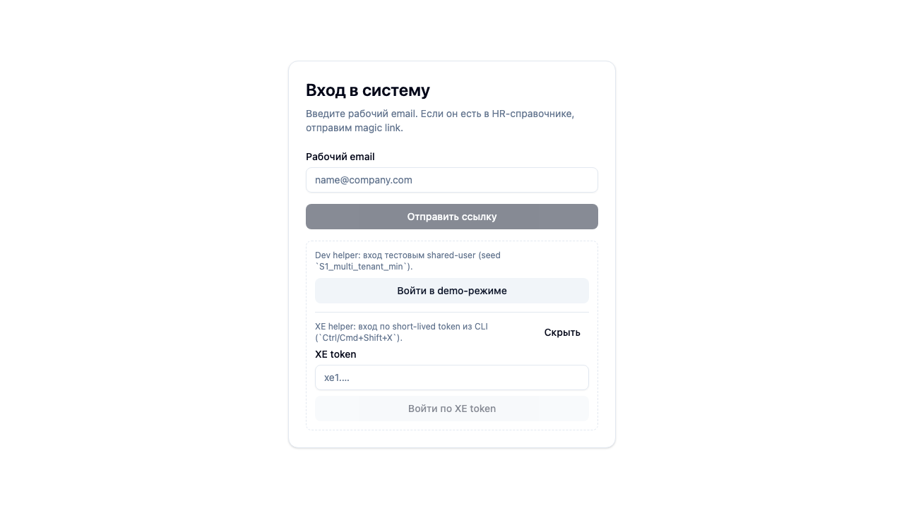
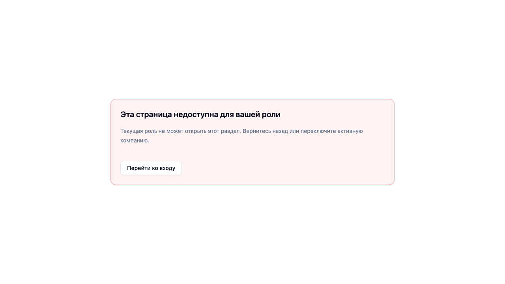
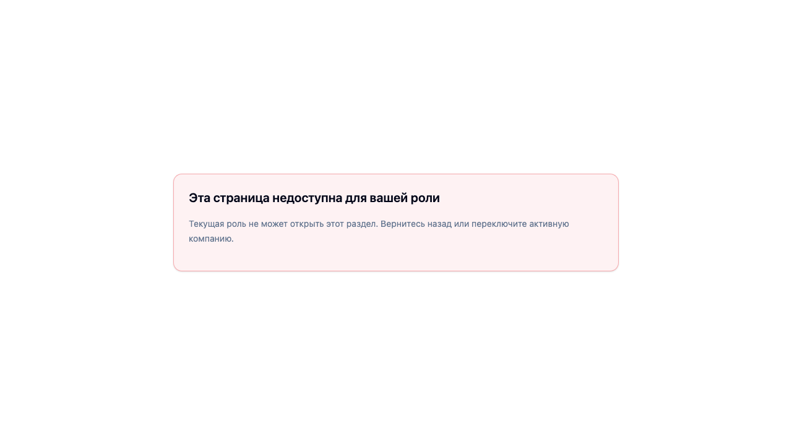
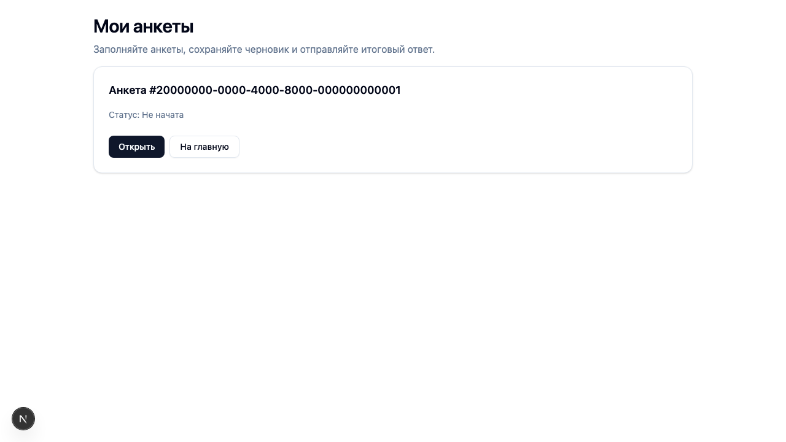
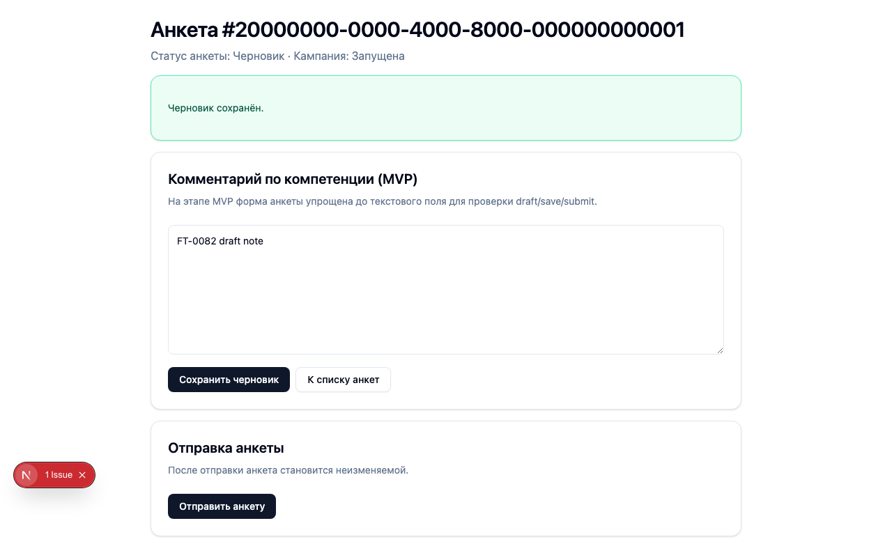
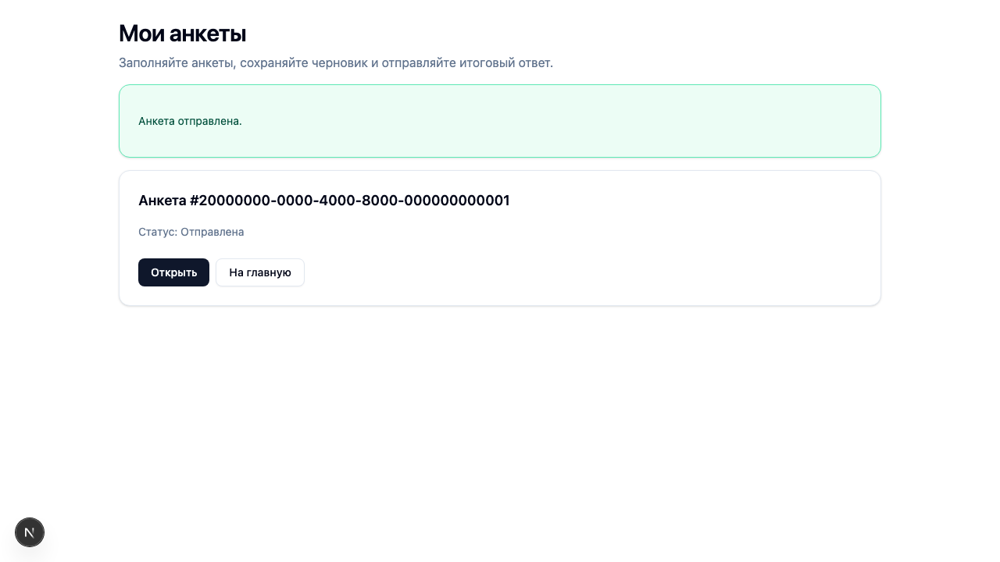
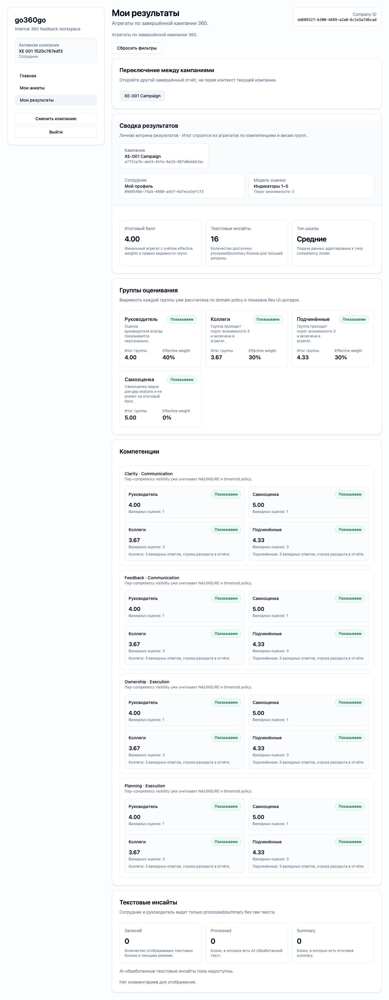
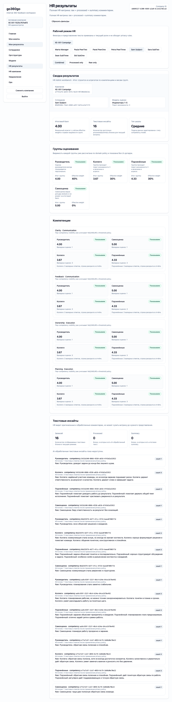

# XE-001 — сценарий по шагам

Этот документ показывает `XE-001` как живой end-to-end сценарий: что делает HR, как система готовит кампанию, как участники проходят анкетирование и что в итоге видят роли в интерфейсе.

> Важно: часть screenshots ниже снята прямо на `beta` с данными `XE-001`, а часть — это репрезентативные screenshots UI-потока анкеты из acceptance evidence. Это сделано потому, что `XE-001` в beta уже завершён и анкеты там находятся в конечном состоянии.

## 1. Вход в сценарий

Мы не используем реальный magic link inbox. Для сценария есть test-only XE token login:

1. CLI выпускает token для нужной роли;
2. на `login page` раскрывается XE helper;
3. token меняется на обычную сессию приложения.

## 2. HR заводит сотрудников

На старте сценария seed создаёт компанию и базовых участников. В ручной проверке HR видит их в справочнике сотрудников.

Что здесь важно:

- у каждого участника есть заранее созданный `user + employee`;
- роли сценария уже разведены;
- всё это относится к одной изолированной XE-компании.

## 3. HR видит оргструктуру

Сценарий создаёт корневое подразделение и engineering-ветку, чтобы на их основе назначать участников кампании и роли оценивания.

## 4. HR использует модель компетенций

`XE-001` работает на indicator-модели. В сценарии используются 4 компетенции, и у каждой есть по 2 индикатора.

На экране моделей HR видит, что версия модели уже подготовлена и может быть использована в кампании.

## 5. HR открывает кампанию

После подготовки данных сценарий создаёт и стартует кампанию `XE-001 Campaign`.

На уровне системы это даёт:

- участников кампании;
- assignments между ролями;
- приглашения через test notification adapter;
- фиксацию snapshot кампании.

Список кампаний:

Карточка кампании:

## 6. Система выпускает приглашения и сессии

Для XE мы не ждём настоящую почту. Вместо этого:

- система фиксирует invite intents;
- runner выпускает actor sessions / XE tokens;
- дальше мы можем входить как любой участник сценария.

Это даёт быстрый и воспроизводимый сквозной прогон без внешней зависимости от inbox.

## 7. Участник открывает список анкет

Дальше сценарий переходит к заполнению анкет. Ниже — репрезентативный screenshot списка анкет из acceptance flow, который использует тот же продуктовый UI.

## 8. Участник сохраняет черновик

Сначала анкета может быть сохранена как draft. Это важно для freeze semantics: первый `draft save` фиксирует кампанию.

## 9. Участник отправляет анкету

После заполнения всех компетенций анкета отправляется. В `XE-001` это делается детерминированно по fixture `fixtures/answers.json`.

То есть сценарий не “угадывает”, как отвечать:

- кто отвечает — зафиксировано;
- какие баллы ставит — зафиксировано;
- какие комментарии пишет — тоже зафиксировано.

## 10. Система считает результаты

После завершения всех ответов сценарий проверяет:

- итоговые агрегаты;
- групповые агрегаты;
- visibility rules для employee / manager / HR;
- совпадение с `fixtures/expected-results.json`.

## 11. Что видит сотрудник

Сотрудник получает свою результирующую витрину.

На этом экране мы проверяем:

- что доступны результаты его кампании;
- что он видит только свой безопасный view;
- что raw comments ему не раскрываются.

## 12. Что видит руководитель

Руководитель открывает `Результаты команды` и может выбрать кампанию и подчинённого из manager-доступного набора.

На этом экране важно:

- есть только допустимые по роли переходы;
- виден subject из manager assignments;
- применяется manager-safe visibility.

## 13. Что видит HR

HR открывает полную витрину результатов.

На этой странице сценарий проверяет:

- что доступна нужная кампания;
- что список сотрудников берётся из snapshot кампании;
- что HR получает полный административный surface для разбора результатов.

## 14. Как это связано с кодом сценария

Сценарий собран из четырёх частей:

- `scenario.json` — каркас сценария и фазы;
- `fixtures/answers.json` — как именно участники заполняют анкеты;
- `fixtures/expected-results.json` — какие результаты считаются правильными;
- `scripts/*.sh` — ручные helper-скрипты для входа в уже созданный run.

## 15. Как вручную пройти результат сценария

Для быстрого ручного просмотра используй:

- `./scenarios/XE-001/scripts/subject-token.sh RUN-20260307121525-c767edf3`
- `./scenarios/XE-001/scripts/manager-token.sh RUN-20260307121525-c767edf3`
- `./scenarios/XE-001/scripts/hr-admin-token.sh RUN-20260307121525-c767edf3`

А подробная инструкция ручной проверки лежит здесь:

- `./scenarios/XE-001/manual-check.md`
